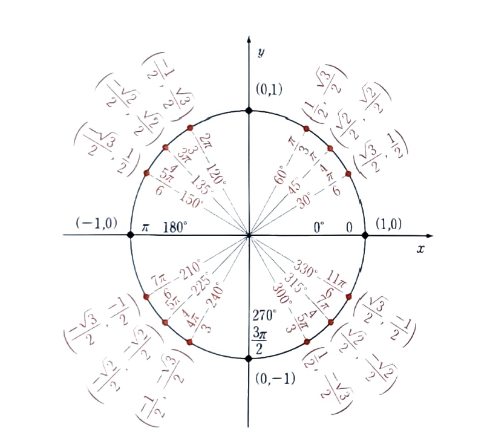
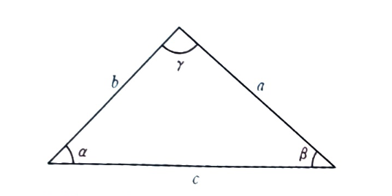

# 수학 기초

선형 대수학에서는 숫자와 함수로 수학을 하는 대신 벡터와 선형 변환으로 수학

## 방정식 풀이

- 방정식의 미지수를 구하는 것을 의미
- 방정식의 좌변에 적용하는 모든 변경 사항을 우변에도 동일하게 적용

## 수

| 이름 | 정의 |
|-----|----|
| 자연수 | $ N = \{0, 1, 2, 3, \dots \} $ |
| 정수 | $ Z = \{ \dots, -2, -1, 0, 1, 2, \dots \} $ |
| 유리수 | $ Q = \{ \frac{5}{3}, \frac{22}{7}, 1.5, 0.125, -7, \cdots \} $ |
| 실수 | $ R = \{ -1, 0, \sqrt{2}, e, \pi, 4.94 \cdots, \cdots \} $ |
| 복소수 | $ C = \{ -1, 0, 1, i, 1+i, 2+3i, \cdots \} $ |

연산
+ 덧셈 (교환법칙, 결합법칙). 뺄셈 (덧셉의 역 연산)
+ 곱셈
+ 나눗셈 : 곱셉의 역 연산
+ 거듭제곱 : $a^n$
+ 우선순위 : 괄호, 지수, 곱셈과 나눗셈, 덧셈과 뺄셈

## 변수

- 임의의 수 또는 미지수
- 변수를 치환하여 방정식을 단순화
$$ \frac{6}{5 - \sqrt{x}} = \sqrt{x} \; \text{애서} \; u = \sqrt{x} \; \text{치환} \qquad \frac{6}{5-u} = u $$

## 함수와 역함수

역함수
+ $f^{-1} $
+ $f^{-1}(y)$ 는 $f(x) = y$ 가 되도록 하는 수 $x$
+ 함수와 역함수는 서로 대칭

| 함수 $f(x)$ | $ \Leftrightarrow $ | 역함수 $f^{-1}(x) $ |
|----|----|----|
| $x+2$ | $ \Leftrightarrow $ | $x-2$|
| $2x$ | $ \Leftrightarrow $ | $\frac{1}{2}x$|
| $-1x$ | $ \Leftrightarrow $ | $-1x$|
| $x^2$ | $ \Leftrightarrow $ | $\pm \sqrt{x}$|
| $2^x$ | $ \Leftrightarrow $ | $\log_2{(x)}$|
| $3x+5$ | $ \Leftrightarrow $ | $\frac{1}{3}(x-5)$|
| $a^x$ | $ \Leftrightarrow $ | $\log_a{(x)}$|
| $\exp(x) \equiv e^x$ | $ \Leftrightarrow $ | $\ln(x) \equiv \log_e{(x)}$|
| $\sin(x)$ | $ \Leftrightarrow $ | $\sin^{-1}(x) \equiv \arcsin(x)$|
| $\cos(x)$ | $ \Leftrightarrow $ | $\cos^{-1}(x) \equiv \arccos(x)$|

## 대수학의 기본 법칙

- 결합 법칙 : $a+b+c = (a+b)+c = a+(b+c) , abc = (ab)c = a(bc)$
- 교환 법칙 : $a+b = b+a, ab = ba$
- 분배 법칙 : $a(b+c) = ab + ac$

**인수분해** : 수식의 공통 부분을 뽑아내는 과정

**이차 인수분해** : 이차 함수를 두 인수의 곱으로 다시 쓰는 것. $ x^2 - 5x + 6 = (x-2)(x-3) $

**완전제곱** : $Ax^2+ Bx + C$의 형태를 $A(x-h)^2 + k$ 형식으로 변형. 상수 $h$ 와 $k$ 는 기본적인 이차 함수의 그래프에서 기하학적으로 수평과 수직 평행 이동으로 해석

## 이차 방정식 풀이

### **근의 공식**

방정식 $ax^2 + bx + c = 0$의 해는
$$ x_1 = \frac{-b + \sqrt{b^2 - 4ac}}{2a} ,  \quad x_2 = \frac{-b - \sqrt{b^2 - 4ac}}{2a}$$

$b^2-4ac>0$ 이면 두개의 근. $b^2-4ac = 0$ 이면 한개의 근. 0보다 작으면 근이 없다(허수)

## 직교 좌표 평면(직교좌표계)

순서쌍 $(x,y)$를 시각화 하는 데 사용

- 점($P(x,y)$) 위치를 표시
- 벡터 ($\vec{v} = (v_1, v_2)$) 표시. (반드시 원점에서 시작할 필요는 없다)
- 함수의 그래프 ($y = f(x)$) : x축은 독립변수, y축은 종속변수

## 함수

변수들 사이의 관계를 규정하는 규칙

- 정의 : 숫자를 입력으로 받고 숫자를 출력하는 수학적 대상 $f : A \rightarrow B$
- **정의역** : 입력값들의 집합
- **치역**, **상** : 가능한 모든 출력값들의 집합
- **공역** : 치역을 포함하는 집합. 출력값의 형태를 나타내는 집합
- 함수는 수에서 수로의 **사상**(mapping)
    - **일대일 함수**, **단사함수** : 서로 다른 각각의 입력을 서로 다른 각각의 출력으로 사상
    - **위로의 함수**, **전사함수** : 함수의 치역과 공역이 같은 경우 (전체 출력값 집합을 다룸)
    - **전단사 함수** : 단사함수이면서 전사함수. 입력값 집합과 출력값 집합이 **일대일 대응**

- 합성 : 하나의 함수를 다른 함수에 적용, **합성함수**
- 역함수 : 전단사함수일 때 역사상을 수행하는 역함수가 존재. $f^{-1}(f(x)) \equiv f^{-1} \bullet f(x) = x $ 

## 여러가지 함수

- 직선 : $f(x) = mx + b$,  $m$은 기울기, $b$는 절편
    - 정의역 : $x \in R$
    - 치역 : $ m \neq 0 \text{ 이면 } f(x) \in R. \quad m=0 \text{ 이면 } \{b\}$
    - $ x = -\frac{b}{m} \text{ : } x \text{ 절편} $
    - 역함수 : $f^{-1}(x) = \frac{1}{m}(x-b) $
    - 일반형 : $ Ax + By = C $

- 제곱 : 이차함수, 포물선. $ f(x) = x^2 $
    - 정의역 : $x \in R$
    - 치역 : $ f(x) \in [0, \infty) $
    - 역함수 : $\sqrt{x} $
    - 2대 1 대응 함수. ($x$ 와 $-x$ 모두 동일한 출력값)

- 제곱근 : $ f(x) = \sqrt{x} \equiv x^{\frac{1}{2}}$
    - 정의역 : $x \in [0, \infty)$
    - 치역 : $ f(x) \in [0, \infty) $
    - 역함수 : $x^2 \quad (x \geq 0 ) \text{ 일 때} $
    - 일반적으로 $x^n$의 역함수는 $ ^n\sqrt{x} $

- 절댓값 : $ f(x) = |x| $
    - 항상 음수가 아닌 숫자를 결과값으로 되돌려준다.
    - $ \sqrt{x^2} \equiv |x| $

- 다항식 : $f(x) = a_0 + a_1x + a_2x^2 + \cdots + a_nx^n$
    - 상수 $a_i$ : 다항식의 계수
    - $n$ : 다항식의 차수
    - 정의역 : $x \in R$
    - 치역 : 계수에 따라 다르다.
    - 근 : $f(x) = 0 \text{ 일 때 } x \text{ 값}$
    - 두 다항식의 합 또한 다항식
    - 차수가 5 이상인 다항식의 경우 일반적인 근의 공식이 존재하지 않는다.
    - **짝수 다항식** : 짝수 지수만을 포함. $f(x) = f(-x) \quad \rightarrow \quad $ **우함수**  
    - **홀수 다항식** : 홀수 지수만을 포함. $f(x) = -f(-x) \quad \rightarrow \quad $ **기함수**

- 사인함수 : $f(x) = \sin(x)$
    - 그래프가 $2\pi$ 를 주기로 반복. **주기적**
    - 정의역 : $x \in R$
    - 치역 : $\sin(x) \in [-1,1]$
    - 근 : $\pi$ 의 모든 정수배
    - 주기가 $2\pi$인 주기함수. $\sin(x) = \sin(x+2\pi)$.
    - **기함수** : $\sin(x) = -\sin(-x)$
    - $\sin^2x+\cos^2x = 1$
    - $\csc(x) \equiv \frac{1}{\sin(x)}$
    - 역함수 : $\sin^{-1}(x) \equiv \arcsin(x)$
    - $\sin(\theta)$ : 밑변과 빗변 사이의 끼인각이 $\theta$인 직각삼각형에서 빗변과 높이의 길이에 대한 비율.

- 코사인함수 : $f(x) = \cos(x)$
    - 사인함수를 $\frac{\pi}{2}$만큼 왼쪽으로 이동. $\cos(x) = \sin\left(x + \frac{\pi}{2}\right)$
    - 정의역 : $x \in R$
    - 치역 : $\cos(x) \in [-1,1]$
    - 근 : $\left(2n+1\right)\frac{\pi}{2}$
    - $\sin^2x+\cos^2x = 1$
    - $\sec(x) \equiv \frac{1}{\cos(x)}$
    - 역함수 : $\cos^{-1}(x) \equiv \arccos(x)$
    - 우함수 : $\cos(x) = \cos(-x)$
    - $\cos(\theta)$ : 밑변과 빗변 사이의 끼인각이 $\theta$인 직각삼각형에서 빗변과 밑변의 길이에 대한 비율.

- 탄젠트 함수 : $f(x) = \tan(x) \equiv \frac{\sin(x)}{\cos(x)}$
    - 정의역 : $\left\{ x \in R | \text{ 모든 } n \in Z \text{ 에 대해 } x \neq \frac{(2n+1)\pi}{2} \right\} $
    - 치역 : $x \in R$
    - 주기가 $\pi$인 주기함수
    - $\cos x = 0$인 $x$ 값에서 발산. 점근선 $ \cdots, \frac{-3\pi}{2}, \frac{-1\pi}{2}, \frac{1\pi}{2}, \frac{3\pi}{2}, \cdots $
    - $ x = 0 \quad $ 이면 값은 0
    - $ x = \frac{\pi}{4} \quad $ 이면 값은 1
    - 역함수 : $\tan^{-1}(x) \equiv \arctan(x)$
    - 역함수는 밑변의 길이가 $l_h$이고 높이가 $l_v$인 직각삼각형의 밑변에서의 각도를 계산하는 데 사용. 각도는 $ \theta = tan^{-1}\left( \frac{l_v}{l_h}\right) $

- 지수 함수 : $f(x) = e^x \equiv \exp(x) $
    - 정의역 : $x \in R $
    - 치역 : $e^x \in (0, \infty)$
    - $ e^ae^b = e^{a+b} \text{ 이므로 } f(a)f(b) = f(a+b) $
    - 지수함수의 도함수는 다시 지수함수. $f(x) = e^x  \Rightarrow f'(x) = e^x $
    - 일반적인 지수함수 : $f(x) = Ae^{\gamma x}$ $A$ 는 초깃값. $\gamma$ 는 지수의 비율. $\gamma > 0 \rightarrow $ 함수 $f(x)$ 는 증가. $\gamma < 0 \rightarrow $ 감소하다가 0에 근접.   

- 자연로그 함수 : $f(x) = \ln(x) = \log_e(x) $
    - 지수함수 $e^x$의 역함수

## 삼각함수

- 직각 삼각형에 대한 성질. 
- 빗변, 높이, 밑변
- 사인, 코사인, 탄젠트 - 각 변의 길이 비율
- $ \sin \theta = \dfrac{\text{높이}}{\text{빗변}}$
- $ \cos \theta = \dfrac{\text{밑변}}{\text{빗변}}$
- $ \tan \theta = \dfrac{\sin \theta}{\cos \theta} = \dfrac{\text{밑변}}{\text{빗변}}$

**삼각함수 항등식**

$$ |\text{밑변}|^2 + |\text{높이}|^2 = |\text{빗변}|^2 $$
$$ \dfrac{|\text{밑변}|^2}{|\text{빗변}|^2} + \dfrac{|\text{높이}|^2}{|\text{빗변}|^2} = 1 $$
$$ \cos^2\theta + \sin^2\theta = 1$$

**단위원**

- 방정식 $x^2 + y^2 = 1$ 을 만족하는 모든 점 $(x,y)$ 로 구성.
- 단위원 위의 점 $P=(P_x, P_y)$ 의 좌표는 $(P_x, P_y) = (\cos\theta, \sin\theta)$ 여기서 $\theta$ 는 $P$가 $x$ 축과 이루는 각.

- $\sin(30^\circ) = \sin\left( \dfrac{\pi}{6}\right) = \dfrac{1}{2}$
    - 이 값을 알면, $\cos(30^\circ), \cos(60^\circ), \sin(60^\circ)$ 를 알 수 있다.
    - 또한 $\sin(45^\circ) = \cos(45^\circ)$ 이므로 이 값 또한 구할 수 있다.

- 비단위원인 경우

$$ \cos\theta = \dfrac{r_x}{r} \qquad \Rightarrow \qquad r_x = r\cos\theta$$
$$ \sin\theta = \dfrac{r_y}{r} \qquad \Rightarrow \qquad r_y = r\sin\theta$$

- 각도를 라디안 변환 : $ \theta \times \dfrac{2\pi}{360} = \text{radian} $

## 삼각함수 항등식

- 단위 빗변
$$ \cos^2\theta + \sin^2\theta = 1 $$
- 사코(sico) + 코사(cosi)
$$ \sin(a+b) = \sin(a)\cos(b) + \cos(a)\sin(b)$$
- 코코(coco) - 사사(sisi)
$$ \cos(a+b) = \cos(a)\cos(b) - \sin(a)\sin(b)$$

- 유도 공식
    - 배각 공식
    - $\sin(2x) = 2\sin(x)\cos(x)$
    - $\cos(2x) = \cos^2(x) - \sin^2(x) = 2\cos^2(x) - 1 = 1 - 2\sin^2(x)$
    - 반각 공식
    - $\cos^2(x) = \dfrac{1}{2}(1+\cos(2x)), \qquad \sin^2(x) = \dfrac{1}{2}(1-\cos(2x))$

- 자기 유사성 (사인, 코사인)
    - 주기가 $2\pi$ 인 주기함수 (함수의 입력값에 $2\pi$의 배수를 더해도 함수는 변하지 않는다.)
    - $2\pi$ 주기 내에서 **자기 유사성**이 있다. ($\sin(\pi - x) = \sin(x) \quad \cos(\pi-x) = -\cos(x) $)

- 사인함수와 코사인함수는 실제로 서로 $\dfrac{\pi}{2}$만큼 평행 이동한 형태 
$$\cos(x) = \sin\left(x + \dfrac{\pi}{2} \right) = \sin\left(\dfrac{\pi}{2} - x \right)$$

$$\sin(x) = \cos\left(x - \dfrac{\pi}{2} \right) = \cos\left(\dfrac{\pi}{2} - x \right)$$

- 덧셈 공식
$$\sin(a) + \sin(b) = 2\sin\left( \dfrac{1}{2}(a+b)\right)\cos\left(\dfrac{1}{2}(a-b)\right)$$
$$\sin(a) - \sin(b) = 2\cos\left( \dfrac{1}{2}(a+b)\right)\sin\left(\dfrac{1}{2}(a-b)\right)$$
$$\cos(a) + \cos(b) = 2\cos\left( \dfrac{1}{2}(a+b)\right)\cos\left(\dfrac{1}{2}(a-b)\right)$$
$$\cos(a) + \cos(b) = -2\sin\left( \dfrac{1}{2}(a+b)\right)\sin\left(\dfrac{1}{2}(a-b)\right)$$

- 곱셈 공식
$$\sin(a)\cos(b) = \dfrac{1}{2}\left(\sin\left( a+b\right) + \sin\left(a-b\right)\right)$$
$$\sin(a)\sin(b) = \dfrac{1}{2}\left(\cos\left( a-b\right) - \cos\left(a+b\right)\right)$$
$$\cos(a)\cos(b) = \dfrac{1}{2}\left(\cos\left( a-b\right) + \cos\left(a+b\right)\right)$$

## 기하학

### 삼각형

- 넓이 : $ A = \dfrac{1}{2}ah_a \qquad a = \text{밑변}, h_a = \text{높이}$
- 둘레 : 세 변 길이의 합
- 내각 공식 : 내각의 합은 $180^\circ$
- 사인 법칙 
$$ \dfrac{a}{\sin(\alpha)} = \dfrac{b}{\sin(\beta)} = \dfrac{c}{\sin(\gamma)}$$
- 코사인 법칙
$$ a^2 = b^2 + c^2 - 2bc\cos(\alpha)$$
$$ b^2 = a^2 + c^2 - 2ac\cos(\beta)$$
$$ c^2 = a^2 + b^2 - 2ab\cos(\gamma)$$

### 원

- 중심이 원점(0, 0)이고 반지름이 $r$ : $x^2+y^2 = r^2$
- 둘레 : $2\pi r$
- 넓이 : $A = \pi r^2$

### 구

- 반지름 $r$ 인 구 : $x^2+y^2+z^2 = r^2$
- 겉넓이 : $A = 4\pi r^2$
- 부피 : $V = \dfrac{4}{3}\pi r^3$

### 원기둥

- 겉넓이 : 윗면과 밑면의 넓이와 옆면을 더한값. $A = 2(\pi r^2) + (2\pi r)h$
- 부피 : 밑면의 넓이에 높이를 곱한 값. $V = (\pi r^2)h$

### 원뿔과 각뿔

- 모든 뿔에 적용되는 일반적인 부피 공식
$$ V = \dfrac{1}{3}Ah \qquad A = \text{ 밑면의 넓이} \quad h = \text{ 높이}$$

## 원

- 원점이 중심, 반지름이 r : $x^2 + y^2 = r^2$
- 중심이 $(p,q)$ 인 경우 : $(x-p)^2 + (y-q)^2 = r^2$
- 원의 방적식은 함수의 형태로 나타낼 수 없다. ($y$에 대해 두가지가 나옴)
- $x$ 와 $y$가 분리되지 않은 관계식으로 표현된 **음함수**
- **양함수**는 두가지. $ y = \sqrt{r^2-x^2}, \quad y = -\sqrt{r^2-x^2}$
- **극좌표** : $r\angle\theta$ $\theta$는 $x$축을 기준 삼아 시계 반대방향으로 측정한 각도
- 극좌표에서 $(x,y)$ 좌표 : $x = r\cos\theta, \quad y = r\sin\theta$
- **매개변수 방정식** : $\{(x, y)\in \mathbb{R}^2 | x = r\cos\theta, y = r\sin\theta, \theta in [0, 360^\circ)\}$
- 넓이 : $A=\pi r^2$
- 둘레 : $C = 2\pi r$
- 호의 길이 : $ l = 2\pi r \dfrac{\theta}{360}$
- 라디안 : $ 2\pi[\text{rad}] = 360^\circ $
- 라디안으로 측정한 호의 길이 : $ l = r\theta_{\text{rad}}$

## 벡터

- 공간에서의 방향을 나타내는 정확한 방법
- 실수의 순서쌍으로 표시하고 각각의 실수는 **성분**
- **벡터 대수** : 순서쌍에 대하여 수행하는 연산
- 2차원 벡터 $\vec{v} \in \mathbb{R}^2 \text{ 는 숫자쌍 } \vec{v} = (v_x, v_y)$ $\quad v_x$ : $\vec{v}$ 의 $x$ 성분. $v_y$ : $\vec{v}$의 $y$ 성분

| 표기법 | 설명 |
|----|----|
| $\vec{v} = (v_x, v_y)$ | 성분 표기법. x축과 y축에 대한 순서쌍 |
| $\vec{v} = v_x\hat{i} + v_y\hat{j}$ | 단위 벡터 표기법 $\hat{i} = (1, 0), \; \hat{j} = (0,1) $|
| $\vec{v} = \lVert \vec{v} \rVert \angle \theta$ | 길이 - 방향 표기법 |

### 벡터 연산

- 덧셈 : $ \vec{u} + \vec{v} =  (u_x + v_x, u_y + v_y)$
- 뺄셈 : $ \vec{u} - \vec{v} =  (u_x - v_x, u_y - v_y)$
- 스케일링 : $ \alpha\vec{u}  =  (\alpha u_x , \alpha u_y)$ : $\alpha < 0$ 이면 벡터가 반대 방향.
- 내적 : $ \vec{u} \cdot \vec{v} =  u_x  v_x + u_y  v_y$
- 길이 : $ \lVert \vec{u} \rVert =  \sqrt{\vec{u} \cdot \vec{u}} = \sqrt{u_x^2+u_y^2}$ : 같은 방향을 가리키는 **단위벡터**를 얻으러면 벡터를 자신의 길이로 스케일링.
- 외적 : $ \vec{u} \times \vec{v} =(u_yv_z - u_zv_y, u_zv_x - u_xv_z, u_xv_y-u_yv_x)$ : 3차원 벡터에서만 정의
- 벡터는 나눈다는 개념이 없다.

### 표기법 변환

- $\lVert \vec{r} \rVert \angle \theta \Rightarrow r_x = \lVert \vec{r} \rVert \cos\theta, \quad r_y = \lVert \vec{r} \rVert \sin\theta$
- $(r_x, r_y) \Rightarrow \lVert \vec{r} \rVert = \sqrt{r_x^2+r_y^2}, \quad \theta = \tan^{-1}\left( \dfrac{r_y}{r_x}\right)$
    - $\tan^{-1}$ 은 $\dfrac{\pi}{2}(90^\circ) \text{ 와 } -\dfrac{\pi}{2}(90^\circ)$ 사이의 값. 이 범위를 벗어난 각도를 찾을 때는 주의.
    - $v_x < 0 $ 인 경우 올바른 $\theta$ 를 얻으려면 $\
    tan^{-1}\left(\dfrac{r_y}{r_x}\right) \text{ 에 } \pi(180^\circ)$를 더해야 한다.

