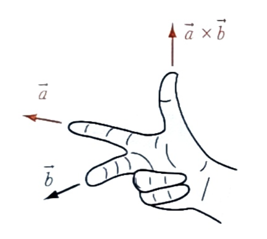
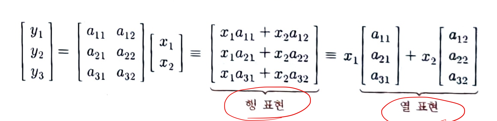

# 선형 대수학 소개

## 정의

- n차원 벡터의 집합 : $ \mathbb{R}^n $
- 벡터 $\vec{v} \in \mathbb{R}^n $은 n개의 실수 순서쌍.
- ex : 3차원 벡터 - $ \vec{v} = (v_1, v_2, v_3) \in (\mathbb{R}, \mathbb{R}, \mathbb{R}) \equiv \mathbb{R}^3 $
- 행렬 $ A \in \mathbb{R}^{m \times n}$ : m개의 행과 n개의 열로 이루어진 실수의 직사각형 배열.
- ex : $ 3 \times 2 $ 행렬 - $ A = \begin{bmatrix} a_{11} & a_{12} \\ a_{21} & a_{22} \\ a_{31} & a_{32} \end{bmatrix} \in \begin{bmatrix} \mathbb{R} & \mathbb{R} \\ \mathbb{R} & \mathbb{R} \\ \mathbb{R} & \mathbb{R} \end{bmatrix} \equiv \mathbb{R}^{3 \times 2} $

## 벡터 연산

$\vec{u} = (u_1, u_2, u_3), \quad \vec{v} = (v_1, v_2, v_3) $
- 덧셈 : + : $\vec{u} + \vec{v} \equiv (u_1 + v_1, u_2 + v_2, u_3 + v_3) $
- 뺄샘 (덧셈의 역) : - : $\vec{u} - \vec{v} \equiv (u_1 - v_1, u_2 - v_2, u_3 - v_3) $
- 스케일링 : $\alpha \vec{u} \equiv (\alpha u_1, \alpha u_2, \alpha u_3)$
- 내적 : $\cdot$ :  $\vec{u} \cdot \vec{v} \equiv u_1  v_1 + u_2  v_2 + u_3  v_3) $
    - 두개의 벡터를 입력으로 취하여 하나의 실수를 출력
    - $\parallel \vec{u} \parallel \parallel \vec{v} \parallel \cos(\varphi)$
    - 사영벡터, 벡터 분해, 직교성을 결정하기 위한 도구
    - **도트 곱** : $\cdot$
    - **스칼라 곱(상수 곱)** : 결과가 기저가 바뀌어도 변하지 않음.
    - 두 벡터의 성분을 알고 있는 경우, 두 벡터 사이의 각도를 찾을 수 있다.
    - $ \cos(\varphi) = \dfrac{\vec{u}\cdot\vec{v}}{\parallel \vec{u} \parallel \parallel \vec{v} \parallel} = \dfrac{u_1v_1 + u_2v_2 + u_3v_3}{\parallel \vec{u} \parallel \parallel \vec{v} \parallel}, \quad \varphi = \cos^{-1}(\cos(\varphi))$
    - 두 벡터가 같은 방향 : $\cos(\varphi) = cos(0^{\circ}) = 1$
    - 두 벡터가 서로 수직 : $\cos(\varphi) = cos(90^{\circ}) = 0$
    - 두 벡터가 정 반대 방향 : $\cos(\varphi) = cos(180^{\circ}) = -1$
    - 모든 차원의 벡터에 대해 정의. 성분 개수가 같다면 계산 가능.
    - 행렬곱셈의 특별한 경우. 열벡터로 생각하면 $\vec{u}\cdot\vec{v} \equiv \vec{u}^T\vec{v}$
- 외적 : $\times$ : $\vec{u} \times \vec{v} \equiv (u_2v_3 - u_3v_2, u_3v_1 - u_1v_3, u_1v_2 - u_2v_1) $ (3차원 정의)
    - 두 개의 벡터를 입력. 다른 하나의 벡터를 출력.
    - 두 벡터 모두에 수직. $ \vec{u} \times \vec{v} = \{ \vec{u} \text{ 와 } \vec{v} \text{ 모두에 수직인 벡터}\} \in \mathbb{R}^3 $
    - **벡터 곱** : 연산의 결과가 벡터
    - 기저 벡터의 외적 : $ \hat{i} \times \hat{j} = \hat{k}, \quad \hat{j} \times \hat{k} = \hat{i}, \quad \hat{k} \times \hat{i} = \hat{j}$
    - **비가환적** : 입력순서를 바꾸면 출력에 음수 부호가 나타남. $\vec{u} \times \vec{v} = - \vec{v} \times \vec{u} $
    - 외적의 출력의 길이는 벡터들 사잇각에 대한 사인값에 비례. $ \parallel \vec{u} \times \vec{v} \parallel = \parallel \vec{u} \parallel \parallel \vec{v} \parallel \sin(\varphi)$
    - **오른손 법칙** : 외적의 방향을 결정할 수 있다.
    
    - 두 번째 벡터에 전치행렬을 적용. : $\vec{u}\vec{v}^T

- 길이 : $ \parallel \vec{u} \parallel \equiv \sqrt{u_1^2 + u_2^2 + u_3^2} $
    - 공간에서 벡터의 범위를 나타내는 음이 아닌 숫자.
    - 벡터의 **크기** 또는 **노름**(norm)
    - 피타고라스 공식을 n차원으로 확장하여 표현
    - **유클리드 길이**, $l^2$ 노름 (엘투노름)
    - 벡터 자기 자신과의 내적의 제곱근.
    - **단위벡터** : 길이가 1인 벡터. $\hat{v} = \dfrac{\vec{v}}{\parallel \vec{v} \parallel}$
    - **사영** : $\vec{v}$의 $hat{d}$ 방향으로의 사영. $ \Pi_{\hat{d}}(\vec{v}) = v_d\hat{d} = (\hat{d} \cdot \vec{v})\hat{d} $
    - 길이가 1이 아닌 벡터에 의하여 방향이 결정될 때 사영벡터. : $ \Pi_{\vec{d}}(\vec{v}) = \left( \dfrac{\vec{d} \cdot \vec{v}}{\parallel \vec{v} \parallel^2}\right)\vec{d}$ 

## 행렬 연산

- 덧셈 : $ A + B $,  뺄셈 (덧셈의 역) : $ A - B $
    - 행렬의 각 성분별로 수행
    - 차원이 동일해야 함.
- 상수 $\alpha$로의 스케일링 : $\alpha A$
    - **스케일링**
    - $\alpha A = \alpha \begin{bmatrix} a_11 & a_12 \\ a_21 & a_22 \\ a_31 & a_32 \end{bmatrix} = \begin{bmatrix} \alpha a_11 & \alpha a_12 \\ \alpha a_21 & \alpha a_22 \\ \alpha a_31 & \alpha a_32 \end{bmatrix}$
- 행렬 곱 : $ AB $
    - A의 각 행과 B의 각 열 사이의 내적을 계산
    - $ C = AB \Leftrightarrow c_{ij} = \sum_{k=1}^la_{ik}b_{kj}, \quad \forall i \in [1, \cdots, m], j \in [1, \cdots, n]$
- 행렬 - 벡터 곱 : $ A\vec{v} $
    - $ \vec{w} = A\vec{v} \Leftrightarrow w_i = \sum_{j=1}^na_{ij}v_j, \quad \forall i \in [1, \cdots, m] $
    - $ A \in \mathbb{R}^{m \times n} , \quad \vec{x} \in \mathbb{R}^n $에 대하여  $ A\vec{x} $ 는 계수 $\vec{x}$ 를 갖는 행렬 $A$의 열들의 **선형결합**을 생성한다.
    
    - 행 표현 : 행렬 $A$ 의 각 행과 $\vec{x}$ 의 내적을 계산
    - 열 표현 : $A$의 열들의 선형결합
    - 선형결합 $\vec{y} = \alpha \vec{e}_1 + \beta \vec{e}_2 \Rightarrow \vec{y} = \begin{bmatrix} | & | \\ \vec{e}_1 & \vec{e}_2 \\ | & | \end{bmatrix} \begin{bmatrix} \alpha \\ \beta \end{bmatrix}$
    - **선형변환**의 추상화 : 행렬 $A \in \mathbb{R}^{m \times n}$에 의한 곱셉. n-벡터를 입력으로 가져와 m-벡터를 출력으로 생성하는 선형변환 $T_A : \mathbb{R}^n \rightarrow \mathbb{R}^m$
    - $T_A$는 행렬 $A$로 표현된다.
- 전치 : $A^T$
    - $A^T$의 i행 j열은 $a_{ij}^T = a_{ji}$ : 대각으로 행렬을 뒤집는다.
    - $(A+B)^T = A^T + B^T$
    - $(AB)^T = B^TA^T$
    - $(ABC)^T = C^TB^TA^T$
    - $(A^T)^{-1} = (A^{-1})^T$
- 역행렬 : $ A^{-1}$
    - 행렬 A가 정방행렬. 그 역이 존재할 때 A의 효과를 상쇄하는 역할을 하는 행렬.
    - $ A^{-1}(A\vec{x}) = A^{-1}A\vec{x} = \vec{x} $
    - $ A^{-1}A = \begin{bmatrix} 1 & 0 \\ 0 & 1 \end{bmatrix} = 1$ : **항등행렬** $I$. 대각성분은 1, 그 밖의 성분은 0
    - **가역행렬**만 역행렬을 갖는다.
    - $(AB)^{-1}  = B^{-1}A^{-1}$
    - $(ABC)^{-1} = C^{-1}B^{-1}A^{-1}$
    - $(A^T)^{-1} = (A^{-1})^T$
    - $(A^{-1})^{-1} = A$
    - 행렬 방정식에서 나눗셈의 역할.
- 대각합 : $ \text{Tr} (A) $
    - 대각선에 있는 n값들의 합.
    - $\text{Tr : } \mathbb{R}^{m \times n} \rightarrow \mathbb{R}, \quad \text{Tr}[A] \equiv \sum_{i=1}^n a_{ii}$
    - $\text{Tr}[\alpha A + \beta B] = \alpha \text{Tr}[A] + \beta \text{Tr}[B]$ : 선형성
    - $\text{Tr}[AB] = \text{Tr}[BA]$
    - $\text{Tr}[ABC] = \text{Tr}[CAB] = \text{Tr}[BCA]$ : 주기성
    - $\text{Tr}[A^T] = \text{Tr}[A]$
    - $\text{Tr}[A] = \sum_{i=1}^n \lambda_i $ : $\{\lambda_i\}$ : A의 고윳값
- 행렬식 : $ \text{det} (A) \text{ or } |A| $
    - 모든 계수를 포함하고 단일 숫자를 출력.
    - 행벡터들에 의하여 결정되는 도형의 기하학적 양과 관계. 행에 의해 주어지는 변으로 이루어진 상자의 크기. (ex. 2차원의 경우 평행사변형의 면적)
    - 행력식이 0이 아니면 행렬의 행들은 선형독립.
    - $\text{det}(AB) = \text{det}(A)\text{det}(B)$
    - $\text{det}(A) = \prod_{i=1}^n \lambda_i$ : $\{\lambda_i\}$ : A의 고윳값
    - $\text{det}(A^T) = \text{det}(A)$
    - $\text{det}(A^{-1}) = \dfrac{1}{\text{det}(A)}$

## 선형성

함수 $f$가 임의의 두 입력 $x_1$과 $x_2$, 그리고 모든 상수 $\alpha$와 $\beta$에 대해 다음의 방정식을 만족하면 **선형**이다.
$$ f(\alpha x_1 + \beta x_2) = \alpha f(x_1) + \beta f(x_2)$$

**원점을 지나지 않는 직선은 선형 함수가 아니다** $\Rightarrow$ **아핀 변환**

변수 $v$가 1제곱으로 표현되는 수식을 $v$에 대한 선형이라고 표현. - 즉 계수는 선형이 아니어도 된다. $ \frac{1}{a}x_1 + b^6x_2 + \sqrt{c}x_3 $는 $x_1, x_2, x_3$에 대해서 선형 수식.

**선형 방정식** : $ a_1x_1 + a_2x_2 + a_3x_3 = c $