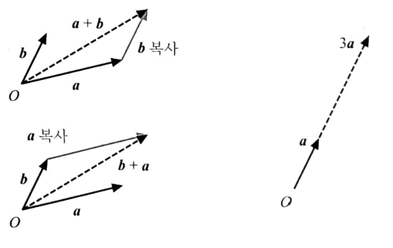

# 프로그래머를 위한 선형 대수 - 벡터, 행렬, 행렬식

저 : 히라오카 카즈유키. 호리 겐
번역 : 이창신

## 벡터

- 수를 나열한 것.
- 횡벡터 : (2, 3, 5)
- 종벡터 : $\begin{pmatrix} 2 \\ 3 \\ 5 \end{pmatrix}$
- Transpose : T. $(2, 3, 5)^T = \begin{pmatrix} 2 \\ 3 \\ 5 \end{pmatrix}$
- 0 벡터 : 모든 성분이 0 :  __0__

### 벡터의 연산

- 덧셈 ( 같은 차원 ) : $\begin{pmatrix} x_1 \\ \vdots \\ x_n \end{pmatrix} + \begin{pmatrix} y_1 \\ \vdots \\ y_n \end{pmatrix} = \begin{pmatrix} x_1 + y_1 \\ \vdots \\ x_n + y_n \end{pmatrix}$
- 덧셈은 화살 표의 이어붙임.
- 정수배 : $c \times \begin{pmatrix} x_1 \\ \vdots \\ x_n \end{pmatrix} = \begin{pmatrix} c \times x_1 \\ \vdots \\ c \times x_n \end{pmatrix}$
- 정수배는 길이의 변화를 나타냄.
- 벡터가 정의된 세계는 선형 공간임.
    - __0__ 벡터만 특별. 그 외는 다 대등.
    - 적용 되는 것 : 덧셈. 정수배
    - 뭐든지 직선형임.

### 벡터의 성질

- $(c \times c^1 )\vec{x} = c \times (c^1 \vec{x})$
- $ 1 \times \vec{x} = \vec{x} $
- $ \vec{x} + \vec{y} = \vec{y} + \vec{x} $
- $ (\vec{x} + \vec{y}) + \vec{z} = \vec{x} + (\vec{y} + \vec{z})$
- $ \vec{x} + \vec{0} = \vec{x} $
- $ \vec{x} + (-\vec{x}) = \vec{0} $
- $ c \times ( \vec{x} + \vec{y}) = c \times \vec{x} + c \times \vec{y}$
- $ (c + c^1)\times \vec{x} = c \times \vec{x} + c^1 \times \vec{x}$

### 기저 벡터

- 기준이 되는 한쌍의 벡터. → 각 벡터는 기저 벡터에서 얼마큼 나아가는 것.
- 조건.
    1. 어떤 벡터 $\vec{\upsilon}$라도 $\vec{\upsilon} = x_1 \times \vec{e_1} + \dots + x_n \times \vec{e_n}$ 형태로 나타낼 수 있다.
    2. 나타내는 방법은 한가지 뿐이다.
- $\upsilon_1 \times \vec{e_1} + \dots + \upsilon_n \times \vec{e_n}$ : $\vec{e_1} \dots \vec{e_n}$의 선형 결합
    - $\vec{e_1} \dots \vec{e_n}$의 선형 결합으로 임의의 벡터 $\vec{x}$가 나타나고, 그 표현법이 유일하면 $(\vec{e_1} \dots \vec{e_n})$을 __기저__ 라고 부른다.
- 기저 벡터의 개수를 가지고 __차원__ 을 정의
- 매번 기저를 표시하는 것은 귀찮으니 생략하고 좌표만 표시 ( 단, 기저가 서로 다른 경우에는 표시 )

## 행렬

- 수를 직사각형 형태로 나타낸 것.
- 행 (Row) : 가로
- 열 (Column) : 세로
- 행과 열이 같으면 __정방행렬__
- 일반적으로 행렬은 대문자, 성분은 소문자($a_{11}$ 앞이 행, 뒤가 열)로 표시
- 벡터도 $n \times 1$ (종벡터), $1 \times n$ (횡벡터) 행렬로 볼 수 있다.

### 행렬의 연산

- 덧셈 : $ \begin{pmatrix} a_{11} & \cdots & a_{1n} \\ \vdots & \cdots & \vdots \\ a_{m1} & \cdots & a_{mn} \end{pmatrix} + \begin{pmatrix} b_{11} & \cdots & b_{1n} \\ \vdots & \cdots & \vdots \\ b_{m1} & \cdots & b_{mn} \end{pmatrix} = \begin{pmatrix} a_{11} + b_{11} & \cdots & a_{1n} + b_{1n} \\ \vdots & \cdots & \vdots \\ a_{m1} + b_{m1} & \cdots & a_{mn} + b_{mn} \end{pmatrix}$ 
- 정수배 : $ c \times \begin{pmatrix} a_{11} & \cdots & a_{1n} \\ \vdots & \cdots & \vdots \\ a_{m1} & \cdots & a_{mn} \end{pmatrix} = \begin{pmatrix} c \times a_{11} & \cdots & c \times a_{1n} \\ \vdots & \cdots & \vdots \\ c \times a_{m1} & \cdots & c \times a_{mn} \end{pmatrix}$
- $-A = (-1)A$
- $A-B = A + (-B)$
- $2A + 3B = (2A) + (3B)$
- 행렬과 벡터의 곱 : $ m*n 행렬 \times n벡터 \Rightarrow m벡터 $
$$  \begin{pmatrix} a_{11} & \cdots & a_{1n} \\ \vdots & \cdots & \vdots \\ a_{m1} & \cdots & a_{mn} \end{pmatrix} \times \begin{pmatrix} b_1 \\ \vdots \\ b_n \end{pmatrix} = \begin{pmatrix} a_{11} \times b_1 + \cdots + a_{1n} \times b_n \\ \vdots \\ a_{m1} \times b_1 + \cdots a_{mn} \times b_n \end{pmatrix}$$
- 정의한 벡터의 덧셈과 정수배를 제대로 유지함 (순수한 관계)
$$ \vec{x} + \vec{y} = \vec{z} \Rightarrow A \times \vec{x} + A \times \vec{y} = A \times \vec{z}$$
$$ c \times \vec{x} = \vec{y} \Rightarrow c \times A \times \vec{x} = A \times \vec{y}$$

### 행렬은 사상

- $n$차원 벡터에 $m \times n$행렬을 곱하면 $m$차원 벡터. $n \rightarrow m$차원
- $m \times n$ 행렬은 $n$차원 공간을 $m$차원 공간에 옮기는 사상.
- $ \begin{pmatrix} a_{11} & a_{12} \\ a_{21} & a_{22} \end{pmatrix}$  첫벤쨰 열은 기저벡터 $\vec{e_1}$의 목적지. 두번째 열은 기저벡터 $\vec{e_2}$의 목적지. ( n 번째 열은 기저벡터 $\vec{e_n}$의 목적지 )
- 사상이 같다면 행렬도 같다. $ A\vec{x} = B\vec{x} \Rightarrow A = B $
- 행렬의 곱은 사상의 합성 : $(m \times n) \times (n \times k) = m \times k$
$$ \begin{pmatrix} b_{11} & \cdots & b_{1n} \\ \vdots & \cdots & \vdots \\ b_{m1} & \cdots & b_{mn} \end{pmatrix} \times \begin{pmatrix} a_{11} & \cdots & a_{1k} \\ \vdots & \cdots & \vdots \\ a_{n1} & \cdots & a_{nk} \end{pmatrix} = \begin{pmatrix} b_{11} \times a_{11} + \cdots + b_{1n}*a_{n1} & \cdots & b_{11} \times a_{1k} + \cdots b_{1n} \times a_{nk} \\ \vdots & \cdots & \vdots \\ b_{m1} \times a_{11} + \cdots + b_{mn} \times a_{n1} & \cdots & b_{m1} \times a_{1k} + \cdots + b_{mn} \times a_{nk} \end{pmatrix}$$
- $\vec{z} = BA\vec{x}$라고 하면 $\vec{x}$를 사상 $A$로 보내고 ($\vec{y}$) $Ax = (\vec{y})$fmf 사상 $B$로 보낸다. $\Rightarrow$ $A$하고 $B$한다. ( $BA$ )
- $DCBA = D(CBA) = (DC)(BA) = (DCB)A \Leftarrow$ 괄호가 의미 없다.
- 하지만 $BA \neq AB$

### 행렬 연산의 성질

- $(cA)\vec{x} = c(A\vec{x}) = A(c\vec{x})$
- $(A+B)\vec{x} = A\vec{x} + B\vec{x}$
- $ A+B = B+A$
- $(A+B)+C = A + (B+C)$
- $(c+c^{'})A = cA + c^{'}A$
- $(cc^{'})A = c(c^{'}A)$
- $A(B+C) = AB + AC$
- $(A+B)C = AC + BC$
- $(cA)B = c(AB) = A(cB)$

### 행렬의 거듭제곱

- 사상의 반복.
- 정방행렬만 가능 ( 행과 열의 수가 같은 것. $n \times n$)
- $AA = A^2 \qquad AAA = A^3$
- $5A^2 = 5(A^2) \qquad AB^2 - C^2 = A(B^2) - C^2$
- $A^{a+b} = A^a \times A^b \qquad (A^a)^b = A^{ab}$
- __주의__ $(A+B)^2 = A^2 + AB + BA + B^2 \qquad (AB)^2 = ABAB$

### 특별한 행렬들

#### 영행렬

- 모든 성분이 0인 행렬 ($O$)
- 모든 것을 원점으로 이동시키는 사상
- $ A + O = O + A = A \qquad AO = O \qquad OA = O $
- $ A \neq O \, , B \neq O $ 임에도 $BA=O$이 가능하다.
- $ A \neq O$ 인데도 $A^2 = O$ 이 가능하다.

#### 단위 행렬

- 대각선만 1이고 모두 0. ($I$)
$$ \begin{pmatrix} 1 & 0 & \cdots & 0 \\ 0 & 1 & \cdots &  0 \\ \vdots & \vdots & \cdots & \vdots \\ 0 & 0 & \cdots & 1 \end{pmatrix}$$
- 아무것도 하지 않는 사상
- $ AI = IA = A $

#### 대각 행렬

- 대각 성분 : 정방행렬의 대각선 상의 값 ( \ )
- 비대각 성분 : 대각 성분을 제외한 나머지
- 비대각 성분이 __모두 0__ 인 행렬
- 축에 따른 신축 (늘고, 줄음 사상)
- $diag(a_1, a_2, \cdots , a_n) = \begin{pmatrix} a_1 & 0 & \cdots & 0 \\ 0 & a_2 & \cdots & 0 \\ 0 & 0 & \cdots & 0 \\ \vdots & \vdots & \cdots & \vdots \\ 0 & 0 & \cdots & a_n \end{pmatrix}$
- $ \vec{y} = A\vec{x} \Rightarrow y_1 = a_1x_1 \; \cdots \; y_n = a_nx_n$ 이렇게 분할 됨. 
- 실질적으로 1차원 문제가 n개
- $ diag(a_1, a_2, \cdots , a_n) \times diag(b_1, b_2, \cdots , b_n) = diag(a_1b_1, a_2b_2, \cdots , a_nb_n)$
- $ diag(a_1, a_2, \cdots, a_n)^k = diag(a_1^k, a_2^k, \cdots, a_n^k)$

### 역행렬

- 역사상
- 정방행렬 $A$에 대해 그 역사상에 대응하는 행렬 $A^{-1} \qquad A\vec{x} = \vec{y} \Rightarrow A^{-1}\vec{y} = \vec{x}$
- 있을 수도 있고 없을 수도 있다.
- $A^{-1}A = AA^{-1} = I $
- $(A^{-1})^{-1} = A \qquad (A^k)^{-1} = (A^{-1})^k$
- __주의__ $(AB)^{-1} = B^{-1}A^{-1} \qquad (ABCD)^-1 = D^{-1}C^{-1}B^{-1}A^{-1} $ _순서가 변경된다_
- 대각행렬의 역행렬 : $diag(a_1, a_2, \cdots, a_n) \Rightarrow diag(\frac{1}{a_1}, \frac{1}{a_2}, \cdots, \frac{1}{a_n})$ 단 $ (a_1, a_2, \cdots a_n)$이 하나라도 0이되면 안된다.

### 블록행렬

- 큰 문제를 작은 부분 문제로 분할
- 행렬의 종횡에 단락을 넣어 각 구역을 작은 행렬로 간주한 것.
$$ A = \begin{pmatrix} a_{11} & a_{12} & | & a_{13} & a_{14} \\ a_{21} & a_{22} & | & a_{23} & a_{24} \\ - & - & | & - & - \\ a_{31} & a_{32} & | & a_{33} & a_{34} \\ a_{41} & a_{42} & | & a_{43} & a_{44} \end{pmatrix} \Rightarrow \begin{pmatrix} A_{11} & A_{12} \\ A_{21} & A_{22} \end{pmatrix} $$
- 덧셈 : $ \begin{pmatrix} A_{11} & \cdots & A_{1n} \\ \vdots & \cdots & \vdots \\ A_{m1} & \cdots & A_{mn} \end{pmatrix} + \begin{pmatrix} B_{11} & \cdots & B_{1n} \\ \vdots & \cdots & \vdots \\ B_{m1} & \cdots & B_{mn} \end{pmatrix} = \begin{pmatrix} A_{11} + B_{11}& \cdots & A_{1n} + B{1n}\\ \vdots & \cdots & \vdots \\ A_{m1} + B_{m1}& \cdots & A_{mn} + B_{mn} \end{pmatrix} $
- 정수배 : $ c \times \begin{pmatrix} A_{11} & \cdots & A_{1n} \\ \vdots & \cdots & \vdots \\ A_{m1} & \cdots & A_{mn} \end{pmatrix} = \begin{pmatrix} c \times A_{11} & \cdots & c \times A_{1n} \\ \vdots & \cdots & \vdots \\ c \times A_{m1} & \cdots & c \times A_{mn} \end{pmatrix}$
- 곱 : $ \begin{pmatrix} B_{11} & \cdots & B_{1n} \\ \vdots & \cdots & \vdots \\ B_{m1} & \cdots & B_{mn} \end{pmatrix} \times \begin{pmatrix} A_{11} & \cdots & A_{1k} \\ \vdots & \cdots & \vdots \\ A_{n1} & \cdots & A_{nk} \end{pmatrix} = \begin{pmatrix} B_{11}A_{11} + \cdots + B_{1n}A_{n1} & \cdots & B_{11}A_{1k} + \cdots + B_{m1}A{nk} \\ \vdots & \cdots & \vdots \\ B_{m1}A_{11} + \cdots + B_{mn}A_{1k} & \cdots & B_{m1}A_{1k} + \cdots + B_{mn}A_{nk} \end{pmatrix}$

#### 행벡터, 열벡터

- 블록행렬의 특별한 형태로 한 방야으로만 작게 나눈 것.
- A의 열벡터
$$ A = \begin{pmatrix} a_{11} & | & a_{12} & | & \cdots & | & a_{1n} \\ \vdots & | & \vdots & | & \cdots & | & \vdots \\ a_{m1} & | & a_{m2} & | & \cdots & | & a_{mn} \end{pmatrix} \Rightarrow (\vec{a+1}, \vec{a_2}, \cdots , \vec{a_n})$$
$$ A\begin{pmatrix} c_1 \\ \vdots \\ c_n \end{pmatrix} = (a_1, \cdots, a_n)\times \begin{pmatrix} c_1 \\ \vdots \\ c_n \end{pmatrix} = a_1c_1 + a_2c_2 + \cdots + a_nc_n$$
- B의 행벡터
$$ B = \begin{pmatrix} b_{11} & \cdots & b_{1n} \\ - & - & - \\ \vdots & \cdots & \vdots \\ - & - & - \\ b_{m1} & \cdots & b_{mn} \end{pmatrix} = \begin{pmatrix} b_1^T \\ \vdots \\ b_m^T \end{pmatrix} $$
$$ Bd = \begin{pmatrix} b_1^T \\ \vdots \\ b_m^T \end{pmatrix} = \begin{pmatrix} b_1^T \times d \\ \vdots \\ b_m^T \times d \end{pmatrix}$$
- $ AB = (a_1, a_2, \cdots, a_n)\begin{pmatrix} b_1^T \\ b_2^T \\ \vdots \\ b_m^T \end{pmatrix}  = a_1b_1^T + a_2b_2^T + \cdots + a_nb_n^T$ 여기서 $a_nb_n^T$는 행렬이다.
- $ BA = B(a_1, a_2, \cdots, a_n) = (Ba_1, Ba_2, \cdots, Ba_n) = \begin{pmatrix} b_1^T \\ b_2^T \\ \vdots \\ b_m^T \end{pmatrix} \times (a_1, a_2, \cdots, a_n)  = \begin{pmatrix} b_1^Ta_1 & b_1^Ta_2 & \cdots & b_1^Ta_n \\ b_2^Ta_1 & b_2^Ta_2 & \cdots & b_2^Ta_n \\ \vdots & \vdots & \cdots & \vdots \\ b_n^Ta_1 & b_n^Ta_2 & \cdots & b_n^Ta_n \end{pmatrix}$ 여기서 $ b_n^Ta_n $은 숫자이다.

### 블록대각행렬

- \ 방향의 __대각선상 블록이 모두 정방행렬__이고 그 외의 블록이 모두 __0__
$$ \begin{pmatrix} A_1 & 0 & \cdots & 0 \\ 0 & A_2 & \cdots & 0 \\ \vdots & \vdots & \cdots & \vdots \\ 0 & 0 & \cdots & A_n \end{pmatrix} = diag(A_1, A_2, \cdots , A_n) $$
- $A_1, A_2, \cdots, A_n$을 대각블록이라 한다.
- 각 블록마다 독립적으로 변환된다라는 형태의 사상
$$ \begin{pmatrix} y_1 \\ y_2 \\ y_3 \\ y_4 \end{pmatrix} = \begin{pmatrix} a_{11} & a_{12} & 0 & 0 \\ a_{21} & a_{22} & 0 & 0 \\ 0 & 0 & a_{33} & a_{34} \\ 0 & 0 & a_{43} & a_{44} \end{pmatrix} \begin{pmatrix} x_1 \\ x_2 \\ x_3 \\ x_4 \end{pmatrix} \Rightarrow \begin{pmatrix} y_1 \\ y_2 \end{pmatrix} = \begin{pmatrix} a_{11} & a_{12} \\ a_{21} & a_{22} \end{pmatrix} \begin{pmatrix} x_1 \\ x_2 \end{pmatrix} \quad \begin{pmatrix} y_3 \\ y_4 \end{pmatrix} = \begin{pmatrix} a_{33} & a_{34} \\ a_{43} & a_{44} \end{pmatrix} \begin{pmatrix} x_3 \\ x_4 \end{pmatrix} $$

### 여러 관계를 행렬로 나타내기

#### 고계차분 - 시계열 분석의 기초

$$ x_t = -0.7x_{t-1} -0.5x_{t-2} + 0.2x_{t-3} + 0.1x_{t-4} $$
$$ \Rightarrow \begin{pmatrix} x_t \\ x_{t-1} \\ x_{t-2} \\ x_{t-3} \end{pmatrix} = \begin{pmatrix} -0.7 & -0.5 & 0.2 & 0.1 \\ 1 & 0 & 0 & 0 \\ 0 & 1 & 0 & 0\\ 0 & 0 & 1 & 0 \end{pmatrix} \begin{pmatrix} x_{t-1} \\ x_{t-2} \\ x_{t-3} \\ x_{t-4} \end{pmatrix} $$
$$ \vec{x(t)} = (x_t, x_{t-1}, x_{t-2}, x_{t-3})^T \Rightarrow \vec{x(t)} = A\vec{x(t-1)}$$

#### 고계미분

$$ \frac{d^4}{dt^4}y(t) = -0.7\frac{d^3}{dt^3}y(t) -0.5\frac{d^2}{dt^2}y(t) + 0.2\frac{d}{dt}y(t) + 0.1y(t)$$
$$ \Rightarrow \frac{d}{dt}y(t) = \begin{pmatrix} \frac{d^4}{dt^4}y(t) \\ \frac{d^3}{dt^3}y(t) \\ \frac{d^2}{dt^2}y(t) \\ \frac{d}{dt}y(t) \end{pmatrix} = \begin{pmatrix} -0.7 & -0.5 & 0.2 & 0.1 \\ 1 & 0 & 0 & 0 \\ 0 & 1 & 0 & 0\\ 0 & 0 & 1 & 0 \end{pmatrix} \begin{pmatrix} \frac{d^3}{dt^3}y(t) \\ \frac{d^2}{dt^2}y(t) \\ \frac{d}{dt}y(t) \\ y(t) \end{pmatrix}$$
$$ \Rightarrow \frac{d}{dt}y(t) = Ay(t) $$

#### 정수항의 나눗셈

$$ y = Ax + b \Rightarrow \begin{pmatrix} y \\ 1 \end{pmatrix} = \begin{pmatrix}  A & b \\ O & 1 \end{pmatrix} \begin{pmatrix} x \\ 1\end{pmatrix}$$

### 좌표 변환과 행렬

- 좌표 변환 : 정방행렬 $A$를 곱한다. $A$에는 역행렬이 존재
- $ \vec{\upsilon} = x\vec{e_x} + y\vec{e_y} = x^{'}\vec{e_{x^{'}}} + y^{'}\vec{e_{y^{'}}} $ 라고 하면 $(x, y)^T 와 (x^{'}, y^{'})^T$의 대응 관계는 기저 $(\vec{e_x}, \vec{e_y})$와 $ (\vec{e_{x^{'}}}, \vec{e_{y^{'}}}) $의 관계
> $ \vec{e_{x^{'}}} = 3\vec{e_x} - 2\vec{e_y} \quad \vec{e_{y^{'}}} = -\vec{e_x} + \vec{e_y}$ 라고 하면  
> $ \vec{\upsilon}  = x^{'}\vec{e_{x^{'}}} + y^{'}\vec{e_{y^{'}}} = x^{'}(3\vec{e_x} - 2\vec{e_y}) + y^{'}(-\vec{e_x} + \vec{e_y}) = (3x^{'} - y^{'})\vec{e_x} + (-2x^{'} + y^{'})\vec{e_y} $  
> $ \Rightarrow  x = 3x{'} - y^{'} \quad y = -2x{'} + y^{'}$  
> $ \Rightarrow  x^{'} = x+y \quad y^{'} = 2x + 3y$  
> 행렬로 나타내면  
> $ \begin{pmatrix} x \\ y \end{pmatrix} = \begin{pmatrix} 3 & -1 \\ -2 & 1 \end{pmatrix} \begin{pmatrix} x^{'} \\ y^{'} \end{pmatrix} $  
> $ \begin{pmatrix} x^{'} \\ y^{'} \end{pmatrix} = \begin{pmatrix} 1 & 1 \\ 2 & 3 \end{pmatrix} \begin{pmatrix} x \\ y \end{pmatrix} $

- 좌표변환은 행렬을 곱한다.
- $ \vec{\upsilon} = A\vec{\upsilon^{'}} \qquad \vec{\upsilon^{'}} = A^{'}\vec{\upsilon}$ 여기서 $A$ 와 $A^{'}$는 서로 역행렬.
- $A^{'} = A^{-1} \quad A = A^{'-1} \quad AA^{'} = A^{'}A = I $

### 전치 행렬 

- 행렬 A의 행과 열을 바꿔 넣는 것. $A^T$
- $(A^T)^T = A $
- 대각행렬 $D^T = D$
- $(AB)^T = B^TA^T$

### 행렬 계산의 예제.

1. 10차원 종벡터 $\vec{x} = (x_1, \cdots, x_{10})^T \; \vec{\upsilon} = (\upsilon_1, \cdots, \upsilon_{10})^T$에 대해 $\vec{y} = \vec{x}\vec{x}^T(I+\vec{\upsilon}\vec{\upsilon}^T)\vec{x}$를 계산하시오

> 초보  
> 1. $\vec{x}\vec{x}^T$ 계산 → 10x10 행렬
> 2. $\vec{\upsilon}\vec{\upsilon}^T$ 계산 → 10x10 행렬
> 3. 2와 $I$ 더함 → 10x10 행렬
> 4. 1과 3곱함 → 10x10 행렬
> 5. $\vec{x}$ 곱함 → (10x10)(10x1) = (10x1) 종벡터

> 고수  
> 1. 식을 전개 : $ \vec{y} = \vec{x}\vec{x}^T\vec{x} + \vec{x}\vec{x}^T\vec{\upsilon}\vec{\upsilon}^T\vec{x}$ : 좌우를 바꾸지 않으면 어디에 괄호를 붙여도 결과는 같다.
> 2. $\vec{x}(\vec{x}^T\vec{x}) + \vec{x}(\vec{x}^T\vec{\upsilon})(\vec{\upsilon}^T\vec{x})$
> 3. $\vec{x}^T\vec{x}$ 계산 : (1x10)(10x1) → 숫자  => a
> 4. $\vec{x}^T\vec{\upsilon}$ 계산 : (1x10)(10x1) → 숫자  => b
> 5. $\vec{\upsilon}^T\vec{x}$ 계산 : (1x10)(10x1) → 숫자 → 4번과 결과는 같다.
> 6. $\vec{y} = \vec{x}(a + b^2) = c\vec{x} \quad c$는 $a+b^2$ → 10차원 종벡터

2. n차 정방행렬 A, n차원 종벡터 $\vec{b}, \vec{c}$ $A^{-1}$ 존재. $C^TA^{-1}\vec{b} \neq -1$ 일때 $ (A + \vec{b}\vec{c}^T)^{-1} = A^{-1} - \frac{A^{-1}\vec{b}\vec{c}^TA^{-1}}{1+C^TA^{-1}\vec{b}} $ 를 증명

> $AA^{-1} = I$ 를 사용 
> 1. $(A+\vec{b}\vec{c}^T)$를 양변에 곱한다.
> 2. $(A+\vec{b}\vec{c}^T)^{-1}(A+\vec{b}\vec{c}^T) = (A^{-1} - \frac{A^{-1}\vec{b}\vec{c}^TA^{-1}}{1+C^TA^{-1}\vec{b}})(A+\vec{b}\vec{c}^T)$
> 3. $ I = (A^{-1} - \frac{A^{-1}\vec{b}\vec{c}^TA^{-1}}{1+C^TA^{-1}\vec{b}})(A+\vec{b}\vec{c}^T) $
> 4. $ I = A^{-1}(A+\vec{b}\vec{c}^T) - \frac{A^{-1}\vec{b}\vec{c}^TA^{-1}(A+\vec{b}\vec{c}^T)}{1+C^TA^{-1}\vec{b}} $
> 5. $ I = A^{-1}A + A^{-1}\vec{b}\vec{c}^T - \frac{A^{-1}\vec{b}\vec{c}^TA^{-1}A + A^{-1}\vec{b}\vec{c}^TA^{-1}\vec{b}\vec{c}^T}{1+C^TA^{-1}\vec{b}}$
> 6. $ I = I + A^{-1}\vec{b}\vec{c}^T - \frac{A^{-1}\vec{b}\vec{c}^T + A^{-1}\vec{b}(\vec{c}^TA^{-1}\vec{b})\vec{c}^T}{1+C^TA^{-1}\vec{b}} $
> 7. 숫자는 뺼 수 있으므로 $ I = I + A^{-1}\vec{b}\vec{c}^T - \frac{A^{-1}\vec{b}\vec{c}^T + (\vec{c}^TA^{-1}\vec{b})A^{-1}\vec{b}\vec{c}^T}{1+C^TA^{-1}\vec{b}} $
> 8. $ I = I + A^{-1}\vec{b}\vec{c}^T - \frac{(1 + \vec{c}^TA^{-1}\vec{b})A^{-1}\vec{b}\vec{c}^T}{1+C^TA^{-1}\vec{b}} $
> 9. $ I = I + A^{-1}\vec{b}\vec{c}^T - A^{-1}\vec{b}\vec{c}^T $
> 10. $ I = I $ 