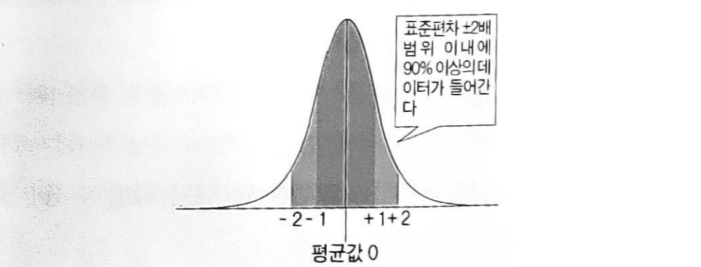

# 세상에서 가장 쉬운 통계학 통계학 입문 - 1부

 - 저 : 고마 히로유키
 - 번역 : 박주영

 ## 도수분포표, 히스토그램, 평균, 분산

 - 도수분포표 : 전체 데이터를 구간들로 나누고 그 구간에 몇 개의 데이터가 들어있는지를 표로 나타낸 것.
    - 상대 도수 : 전체 데이터 중에 몇개의 데이터가 들어있는 지의 비율. 상대 도수의 합은 1
    - 누적 도수 : 그 구간까지 데이터의 얼마나 쌓였는지를 나타낸다. 최종 누적도수는 데이터의 총 개수

    | 계급    | 계급값 | 도수 | 상대도수  | 누적도수 |
    |-----   |------|-----|---------|-------|
    |141~145 | 143  | 1   | 0.01245 |  1    |
    |146~150 | 148  | 6   | 0.075   |  7    |
    |151~155 | 153  | 19  | 0.2375  |  26   |
    |156~160 | 158  | 30  | 0.375   |  56   |
    |161~165 | 163  | 18  | 0.225   |  74   |
    |166~170 | 168  | 6   | 0.075   |  80   |

    - 데이터에 있는 수치 자체는 잃어버린다.
    - 데이터의 분포를 알 수 있다.

- 히스토그램 : 도수분포표를 그래프로 나타낸 것.

- 평균 : 자료들의 대표값 중 하나
    - 산술 평균 : $(x_1 + .... + x_n) / n $
    - 기하 평균 : $\sqrt[n]{x_1 \times x_2 \times ... \times x_n}$ : 평균 성장률
    - 제곱 평균 : $\sqrt{\frac{x_1^2 + x_2^2 + ... + x_n^2}{n}}$ : 표준 편차
    - 조화 평균 : $\frac{n}{\frac{1}{x_1} + \frac{1}{x_2} + ... + \frac{1}{x_n}}$ : 평균적인 변화율. 속도 계산

    - _도수분포표로 산술 평균 구하기_ : $\sum (대표값*상대도수)$ : 산술평균과는 정확히 일치 하지 않는다.

- 분산
    - $\sum \frac{(x_1-u)^2 + \dots + (x_n-u)^2}{n} \qquad u$ : 평균
    - 자료의 퍼진 정도. 
    - 제곱의 합이므로 단위가 다르다. 단위를 같게 하기위해 분산에 Root 씌운 것이 표준 편차
    - _도수분포표로 구하기_ : 
        1. 도수 분포표로 평균 개산
        2. $(1에서 구한 평균 - 대표값)^2$
        3. 2값에 상대도수 곱하기
        4. 3의 합

## 표준 편차

- 분산에 Root
- 알 수 있는 것
    1. 한 데이터 세트 중에 있는 어떤 데이터 하나의 수가 갖는 의미
    2. 여러 데이터 세트들을 서로 비교해서 나타내는 차이
- 표준 편차 $\pm 1$영역 : 약 70% 데이타
- 표준 편차 $\pm 2$영역 : 약 95% 데이타
- 데이터에 일정한 수 더할 경우 : 평균은 평균 + 일정한 수로 변경. 표준편차는 동일
- 데이터에 일정한 수 곲할 경우 : 평균은 평균*일정한 수, 표준편차는 일정한 수 * 표준편차
- 위의 두가지 성질로 __표준 정규붙포__(평균 0, 표준편차 1)가 나온다.

## 표준 정규 분포

- 평균 : 0, 표준 편차 1일 분포
- $\frac{X-\bar{x}}{\sigma}$
- 평균 (0)을 중심으로 한 좌우 대칭 종 모양
- $\pm1$ : 0.6826, $\pm2$ : 0.9544
- $\pm1.96$ 사이에 95%의 데이터가 존재한다. 

## 가설 검정

- 귀납적 추론
- 정규분포(또는 가까운)에서 모수가 어떤지 추측하는 가설 검증.
- 모수의 모집단이 정규분포이고, 평균 $u$, 표준편차 $\sigma$ 이면 관측된 데이터 X가 $ -1.96 \leq \frac{X-u}{\sigma} \leq 1.96$이 성립하면 가설 체택. 아니면 기각

## 구간 추정 

- 모집단의 모수를 가정했을 때 관측된 데이터의 95% 구간에 현실적으로 관측된 데이터가 들어 있을 모수만을 모으는 추정 방법.  
- 모수의 범위는 95% 신뢰 구간
- 구간 추정으로 구해진 구간은 검정의 작업을 모든 모수에 실행하여 기각되지 않고 남은 것을 모은 것
- 정규 모집단에 대한 표준편차 $\sigma$를 알고 있을 때 모르는 평균값 $u$를 구간 추정하는 방법 관측된 데이터 x를 사용하여 $ -1.96 \leq \frac{x-u}{\sigma} \leq 1.96$ 을 풀고 $* \leq u \leq *$ 형태가 되면 된다
- 95% 신뢰 구간이란, 다양한 관측값에서 같은 방법으로 구간 추정을 하면 그 중의 95%는 바른 모수를 포함하고 있는 구간을 말한다.