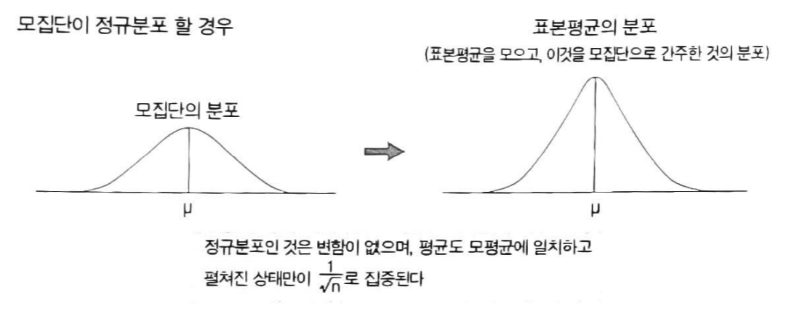
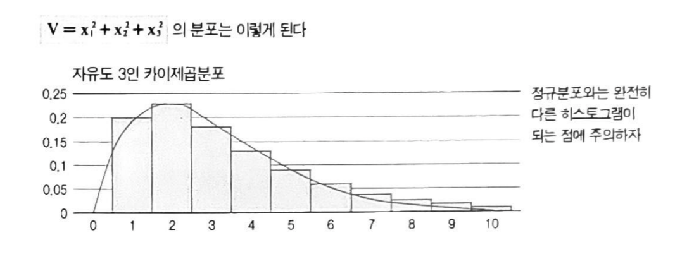
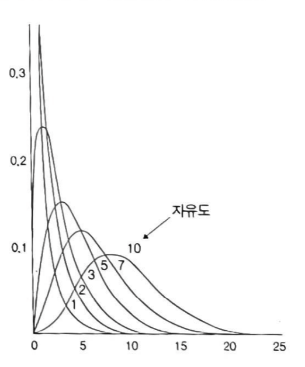
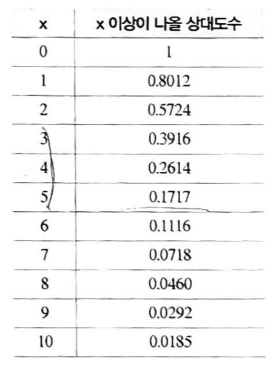
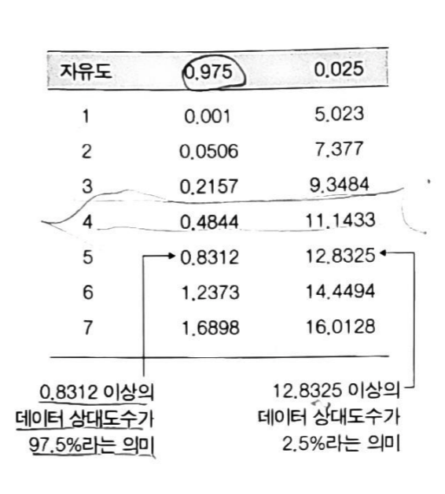
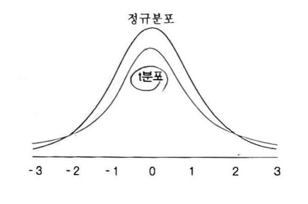
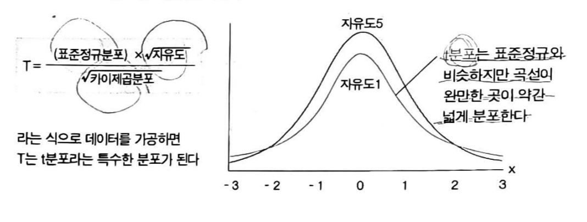
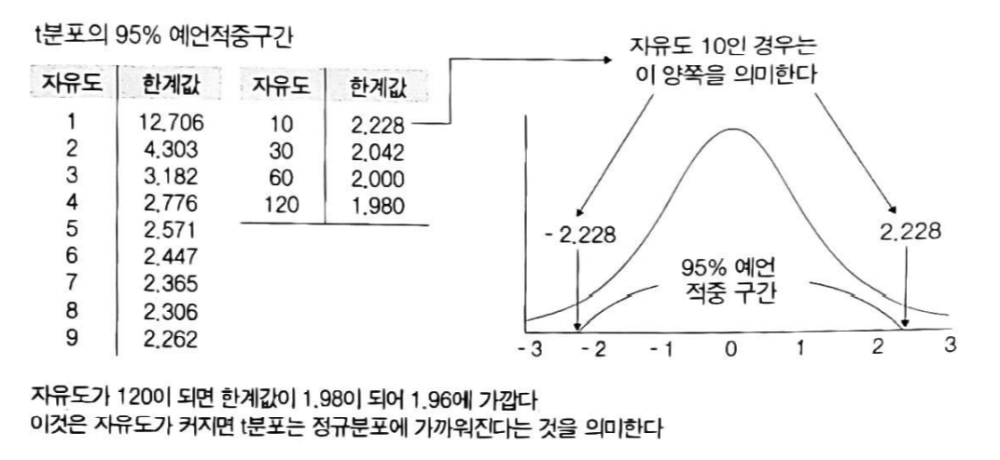
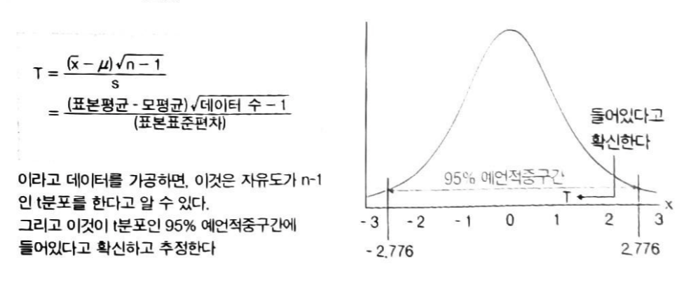

# 세상에서 가장 쉬운 통계학 통계학 입문 - 2부

 - 저 : 고마 히로유키
 - 번역 : 박주영

 ## 모집단과 통계적 추정 : 부분으로 전체를 판단

 - 현실에서 관측되는 데이터의 상대도수는 모집단의 확률분포와 일치 ( 랜덤샘플링의 가정 )
 - 충분히 관측된 데이터로 모평균을 추측 ( 계급값 * 상대도수의 합들로 )
 - 데이터가 충분히 많아야 한다.
 - ? 많이 관측되지 않은 데이터로부터 모평균을 추측하는 방법

 ## 모분산과 모펴준편차

 - 모집단 데이타의 분포상태를 나타내는 통계랑
 - 편차 = $데이터 수치 - u(모평균)$
 - 모분산 : $ \sigma ^2 = \sum (편차^2 * 상대도수) $
 - 모표준편차 : $\sigma = \sqrt{모분산(\sigma ^2)} $

 ## 표본 평균

 - 여러 데이터의 평균값은 한 데이터의 평균값보다 모 평균에 가깝다.
 - 체비세프 부등식 : $u$ 에서 $\sigma \times k$ 이상 떨어진 데이터는 전체의 $\frac{1}{k^2}$ 비율 이하 밖에 없다.
 - 여러 데이터를 관측해 그 평균을 구한 것을 표본평균 ($\bar x$)
 - 관측 데이터를 증가시키면 증가시킬수록 표본 평균이 모평균에 가까울 가능성이 높아진다.
 - 대수의 법칙 : 하나의 모집단에서 n개의 데이터를 관측. 그 표본 평균 $\bar {x}$를 만든다. 이떄 n이 크면 클 수록 표본평균은 모평균 $u$ 에 가까운 수치를 구할 가능성이 커진다.
 - 정규 모집단 : 모집단이 정규 분포 → 포본 평균을 만들어도 그 분포는 정규분포 그대로
 - 모평균 $u$ , 모표준편차 $\sigma$ 일 때 관측된 데이터 x의 n개에 대한 표본 평균 $\bar{x}$의 분포는 정규분포
 - $\bar{x}$ 분포 평균값은 $u$ 그대로지만, 표준 편차는 $\frac{\sigma}{\sqrt{n}}$

 

 - 정규 모집단에서 표본 평균의 95% 구간   $u - 1.96 \times \frac{\sigma}{\sqrt{n}} \leq \bar{x} \leq u + 1.96 \times \frac{\sigma}{\sqrt{n}}$
 - 관측한 데이터의 개수가 많은 수록 구간은 좁아진다.

 ## 모분산을 알고 있는 정규모집단의 모평균

 - n개의 데이터를 관측 표본평균 $\bar{x}$ 를 계산하는 것을 반복. → $\bar{x}$ 의 분포는 평균값이 모평균과 같은 $u$ 이고, 표준편차는 $\frac{\sigma}{\sqrt{n}}$ 이 된다.
 - 그래서 데이터 n개의 표본 평균이 들어간 범위 95%는  $-1.96 \leq \frac{\bar{x}-u}{\frac{\sigma}{\sqrt{n}}} \leq 1.96$
 - 이것을 $u$ 에 대해서 풀면  $\bar{x} - 1.96 \times \frac{\sigma}{\sqrt{n}} \
 leq u \leq \bar{x} + 1.96 \times \frac{\sigma}{\sqrt{n}}$
 - 모평균 $u$ 의 95% 신뢰구간이 된다.

 ## 카이제곱 분포

 - 표분분산 : 관측 데이터 (표본)로 계산한 분산   $s^2 = \frac{\sum (x_i-\bar{x})^2}{n}$
 - 보통은 (n-1)로 나눈다. (자유도)
 - 표본분산은 모분산을 반영하는 분포이지만 __정규분포가 아니다__. ← 제곱해서 더한 것을 나눈 것이므로 항상 양수
 - __카이제곱분포__   $V = x_1^2 + x_2^2 + \cdots x_n^2$ : 관측한 데이터를 제곱해서 더한 것.   이 V의 분포.
 - 0이상의 수치만으로 한정. 0에 가까운 곳에 많은 데이터 밀집.

 

 - 자유도에 따른 분포

 

 - 특징
    - 0근처의 데이터 상대도수가 크다.
    - 자유도 n이 커짐에 따라서 가운데 볼록한 높이가 낮아지면서 점점 오른쪽으로 치우쳐 간다.
- 카이제곱분포표 : 자유도에 따라 x이상의 데이터가 전체에서 차지하는 비율

  자유도가 3인 테이블

### 모분산을 카이제곱분포로 추정.

- 모평균을 알고 있을 때의 모분산의 구간 추정

$$ V = (\frac{x_1-u}{\sigma})^2 + \cdots + (\frac{x_n-u}{\sigma})^2 $$

- V는 자유도 n인 카이제곱분포를 따른다.
- n개의 데이터로 V를 구한다. $V = \frac{숫자}{\sigma^2}$ 형태 ( 모평균을 알고 있다 )
- 자유도 n인 카이제곱분포의 95% 구간을 도표로부터 a 이상 b이하 형식으로 구한다.
$$ a \leq \frac{숫자}{\sigma^2} \leq b $$
- 부등식을 $\sigma^2$에 관해서 푼다.

> $u = 80$ 관측된 4개의 데이터 76,77,83,84 95% 모분산 구간 추정
> $$ V = \frac{(76-80)^2}{\sigma^2} + \frac{(77-80)^2}{\sigma^2} + \frac{(83-80)^2}{\sigma^2} +\frac{(84-80)^2}{\sigma^2} $$
> $$ V = \frac{50}{\sigma^2} $$
> 자유도 4일 떄 카이제곱분포 95% 신뢰 구간. $ 0.4844 \leq \quad \leq 11.1433 $
> $$ 0.4844 \leq \frac{50}{\sigma^2} \leq 11.1433 $$
> $$ 4.487 \leq \sigma^2 \leq 103.220 $$

### 표본분산의 분포는 카이제곱분포

$$ W = \sum (\frac{x_i - \bar{x}}{\sigma})^2 = \frac{\sum(x_i - \bar{x})^2}{\sigma^2}$$
으로 정의
$$ s^2 = \frac{\sum(x_i - \bar{x})^2}{n} $$
$W 와 s^2$의 분자가 서로 같다. 즉
$$ n \times s^2 = \sigma^2 \times W $$
$$ s^2 = \frac{\sigma^2 \times W}{n}, W = \frac{n \times s^2}{\sigma^2} $$
즉 W는 표본분산에 비례하는 통계랑. _단 자유도는 n-1_

## 모평균이 미지인 정규 모집단을 구간 추정.

### 모분산 추정 방법.

- 위의 W를 이용한다.
1. 관측된 n개의 데이터에서 표본평균 ($\bar{x}$) 계산, 그리고 표분분산($s^2$) 계산
2. 통계랑 W 만듬 $ W = \frac{n \times s^2}{\sigma^2}$
3. 자유도 n-1 인 95% 구간 조사.
4. 95구간 부등식을 ${\sigma^2}$에 대해 푼다.

> 데이터 : 76, 86, 82, 80, 77, 모분산 $\sigma^2$의 95% 신뢰 구간
> $$ \bar{x} = (76+86+82+80+77)/5 = 80 $$
> $$ s^2 = 10.8 $$
> $$ W = \frac{5 \times 10.8}{\sigma^2} = \frac{54}{\sigma^2} $$
> 자유도 4 (5-1) 구간 : 0.4844 ~ 11.1433
> 부등식을 $\sigma^2$에 대해 풀면
> $$ 4.85 \leq \sigma^2 \leq 111.48

### t분포

- 통계량 T

> 1. 데이터 n개의 표본평균 $\bar{x}$를 계산
> 2. 데이터 n개의 표본표준편차 s를 계산
> 3. 표본평균 $\bar{x}$에서 모평균 $\mu$를 빼고 표본표준편차 s로 나누며 데이터 수에서 1일 뺀 수에 루트를 한 $\sqrt{n-1}$을 곱한다.
> $$ T = \frac{(\bar(x)-\mu) \times \sqrt{n-1}}{s} $$

- 통계량 T의 분포를 자유도 n-1인 __t분포__ 라고 한다.
- 정규분포와 아주 비슷. 정규분포보다 볼록한 부분이 약간 낮고, 그만큼 완만한 곳은 높다.

- t분포의 정식적인 정의

__표준정규분포를 따르는 데이터 z와 자유도 k의 카이제곱분포를 하는 데이터 W로부터__
$$ T = \frac{z \times \sqrt{k}}{W} $$
__라고 계산되는 통계량 T는 자유도 k의 t분포를 한다.__

- t분포는 상대도수를 확실히 알고 있는 분포

### t 분포로 구간 추정

- 정규모집단에서 모분산을 모를 때의 모평균 추정
- t분포의 95% 구간

- t검정 : t 분포를 이용하여 $\mu$ 가 95% 신뢰구간 안에 있는 지 확인

> 1. n개의 표본에서 표본평균 $\bar{x}$ 와 표준표본편차 s를 계산
> 2. 통계량 T 계산
> $$ T = \frac {(\bar{x} - \mu) \times \sqrt{(n-1)}}{s} $$
> 3. t분포표를 이용행 95% 구간 만들기 $-\alpha \leq T \leq +\alpha $
> 4. 하기 부등식을 $\mu$에 대해서 푼다
> $$ -\alpha \leq \frac{(\bar{x}-\mu) \times \sqrt{n-1}}{s} \leq \alpha