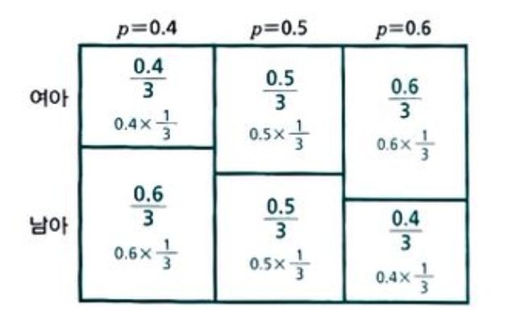
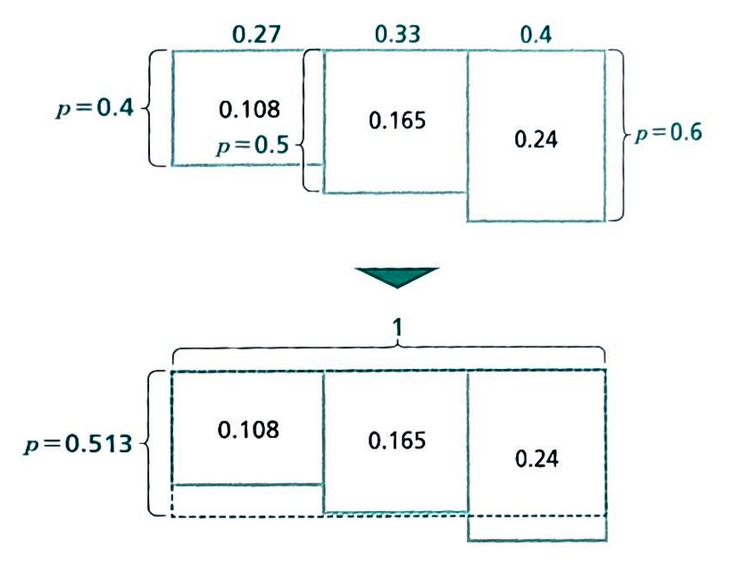
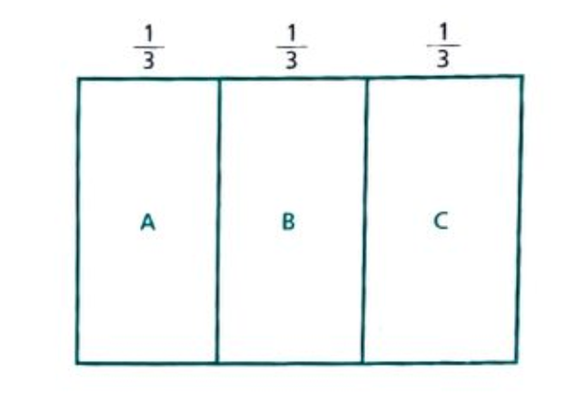
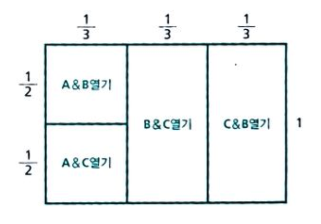
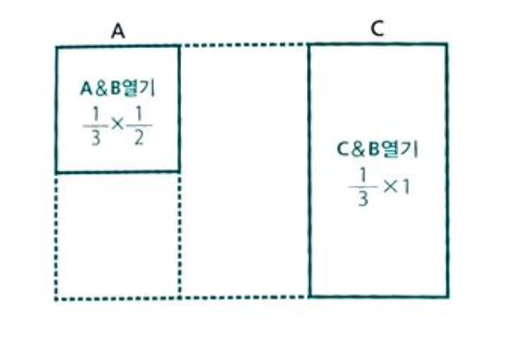

# 세상에서 가장 쉬운 베이즈통계학 입문 - 1

저 : 고지마 히로유키
번역 : 장은정

## 베이즈 추정의 프로세스 정리

1. 타입에 대한 __사전확률__의 설정
    - 쇼핑족과 아이쇼핑족이 있다. (0.2, 0.8)
2. 각 타입에 대한 조건부 확률의 설정
    - 각각 말을 걸 확률은 ( 쇼핑족 0.9, 아이소핑족 0.1)

3. 행동의 관측
    - 말을 걸어왔다
4. 일어나지 않을 가능성의 소거
    - 말을 걸지 않는다를 지운다
    
5. 타인에 대한 확률의 정규화
    - 더해서 1이 되도록 만든다
6. 사후확률(베이즈 역활률)
    - 말을 거는 손님이 살 확률이 달라졌다.
    

- 베이즈 추정이란 __사전확률의 행동의 관찰(정보)에 의거해 사후확률로 베이즈 갱신하는 것__

### 베이즈 추정은 때로 직감에 크게 반한다
> ex. 특정 암에 걸릴 확률 0.1%, 암에 걸렸을 때 검사에서 양성이 나올 확률 95%, 건강하지만 검사에서 양성이 나올 확률 2% (오진). 이 경우 양성일 경우 암에 걸려 있을 확률?
> 단순학게 95%가 아님.
> 검사에서 양성이 나왔을 떄 암에 걸려 있을 사후확률을 구하는 것임.
> 위의 프로세스에 따라서 결과를 구하면 약 4.5%가 나온다.
>
>> - 95% -> 4.5% 줄은 이유 : 원래 암에 걸린 사람 자체가 드물고 건강한 사람을 양성으로 진단하는 사례 또한 무시할 수 없을 만큼 많다.
>> - 하지만 검사전 1000명 중 1명 꼴에서 20명에 1명꼴로 가능성이 높아졌으므로 마냥 무시해서는 안되는 상태. 

### 주관적인 숫자여도 추정이 가능
- 객관적인 사전 데이터가 없어도 추정이 가능
- 사전확률을 주관적으로 설정(__주관확률__)하여 추정을 실시

### 확률의 확률을 사용하여 추정

- Sample 문제 : 어떤 부부의 첫째 아이가 여야였다고 치자. 이때 그 부부에게서 태어날 둘째 아이가 여아일 확률은 몇일까?
- 가정 : 그 부부에게 태어날 아이가 여아일 확률을 0.4, 0.5, 0.6의 세가지 타입으로 설정, 각각 그 타입일 확률은 1/3로. 

- 첫째가 여아기 때문에 일어날 가능성 소거

- 비율로 합이 1이 되도록 수정하면
    - 0.4의 사후확률 = 4/15 = 약 0.27
    - 0.5의 사후확률 = 1/3 = 약 0.33
    - 0.6의 사후확률 = 2/5 = 0.4
- 사전, 사후 확률은 모두 주관 확률 (개인적인 의견으로 판단)

- 다음에 여아가 태어날 확률을 구하려면 기대치를 사용.
    - 0.4 * 0.27 + 0.5 * 0.33 + 0.6 * 0.4 = 0.513
    

## 추론

- 몇 가지 증거를 바탕으로 추리하여 그 사실을 밝혀내려는 행위
- 논리적 추론 : 논리학의 연역법에 따라 엄밀하게 결론을 도출
- 확률적 추론 : 불확실한 부분이 있을 때. 대체로 **다라는 결론
    - 표준 통계학 추정 : 일정한 리스크를 감수. **다와 같은 형식으로 하나의 결론 (네이만 피어슨 식 추정, 유의 수준) : 유의 수준이 리스크의 지표. ( 같은 방법으로 가설검정을 되풀이하는 경우에 유의수준의 확률로 잘못된 결론을 내린다. )
    - 베이즈 추정 : 양쪽 다 가능하지만 **의 가능성이 더 높다라는 형식. : 리스크 평가는 사후확률 그 차제. 항상 자의성이 있으며 그 책임은 통계가의 판단
    - 최우원리 : 관측된 현상이 일어날 확률이 가장 커지는 원인을 채용
        - 베이즈의 사전확률은 최우원리를 응용한 한 형태
        - 표준 통계학의 점추정에서 곽측된 현상의 확률을 최대한으로 하는 함수를 추정치로 채용.(최우원리 응용)
        - 표준 통계학, 베이즈 : 최우원리라는 공통된 사상이 내재.
- 몬티홀 문제의 베이즈 추론
    - A, B, C를 커튼 A에 자동차, 커튼 B에 자동차, 커튼 C에 자동차로 약기
    
    
    - 조건부 확률 설정. 커튼 A를 골랐을 때 A에 자동차가 있다면 B, C를 1/2 확률로 연다. B에 자동차가 있다면 C를 1의 확률로, C에 있다면 B를 1의 확률로 연다.
    

    - B를 열면 일어날 가능성 없는 세계 소거
    

    - 따라서 사후 확률은 A : 1/3, C : 2/3  => C로 변경하는 것이 좋다.
    - 만약 모델 설정을 바꾸면 (커튼 여는 조건을 바꾸게 되면) 사후 확률 변화가 없게도 할 수 있다. (A를 고르고 A뒤에 차가 있으면 무조건 B를 연다라는 조건)

