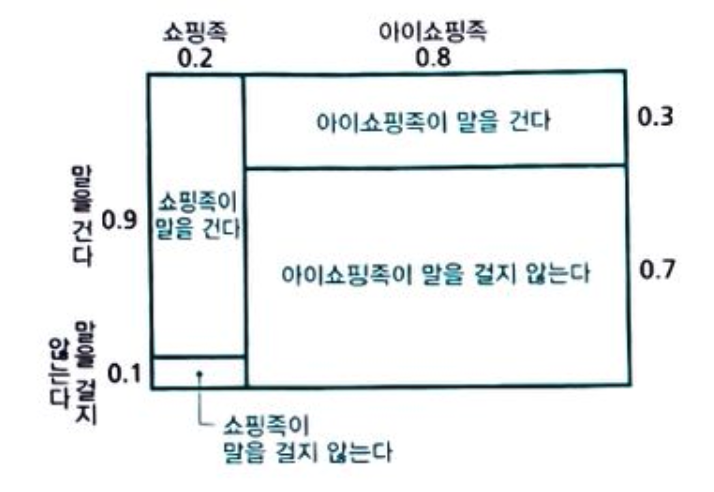
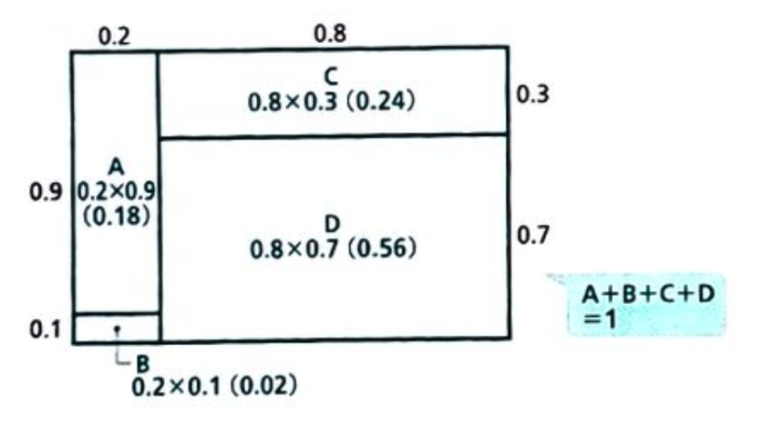
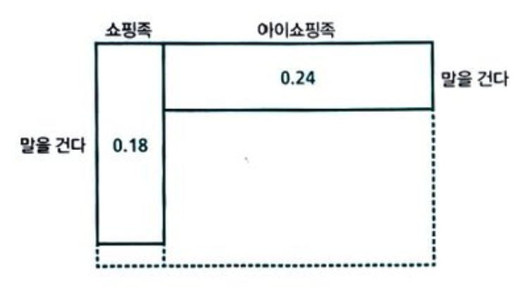
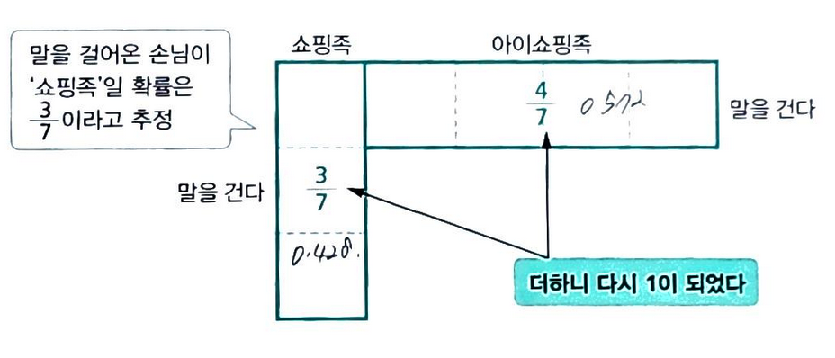

# 세상에서 가장 쉬운 베이즈통계학 입문 - 1

저 : 고지마 히로유키
번역 : 장은정

## 베이즈 추정의 프로세스 정리

1. 타입에 대한 __사전확률__의 설정
    - 쇼핑족과 아이쇼핑족이 있다. (0.2, 0.8)
2. 각 타입에 대한 조건부 확률의 설정
    - 각각 말을 걸 확률은 ( 쇼핑족 0.9, 아이소핑족 0.1)

3. 행동의 관측
    - 말을 걸어왔다
4. 일어나지 않을 가능성의 소거
    - 말을 걸지 않는다를 지운다
    
5. 타인에 대한 확률의 정규화
    - 더해서 1이 되도록 만든다
6. 사후확률(베이즈 역활률)
    - 말을 거는 손님이 살 확률이 달라졌다.
    

- 베이즈 추정이란 __사전확률의 행동의 관찰(정보)에 의거해 사후확률로 베이즈 갱신하는 것__

### 베이즈 추정은 때로 직감에 크게 반한다
> ex. 특정 암에 걸릴 확률 0.1%, 암에 걸렸을 때 검사에서 양성이 나올 확률 95%, 건강하지만 검사에서 양성이 나올 확률 2% (오진). 이 경우 양성일 경우 암에 걸려 있을 확률?
> 단순학게 95%가 아님.
> 검사에서 양성이 나왔을 떄 암에 걸려 있을 사후확률을 구하는 것임.
> 위의 프로세스에 따라서 결과를 구하면 약 4.5%가 나온다.
>
>> - 95% -> 4.5% 줄은 이유 : 원래 암에 걸린 사람 자체가 드물고 건강한 사람을 양성으로 진단하는 사례 또한 무시할 수 없을 만큼 많다.
>> - 하지만 검사전 1000명 중 1명 꼴에서 20명에 1명꼴로 가능성이 높아졌으므로 마냥 무시해서는 안되는 상태. 

### 주관적인 숫자여도 추정이 가능
- 객관적인 사전 데이터가 없어도 추정이 가능
- 사전확률을 주관적으로 설정(__주관확률__)하여 추정을 실시