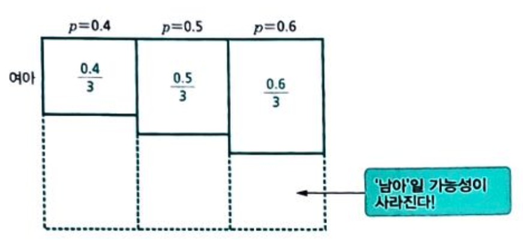
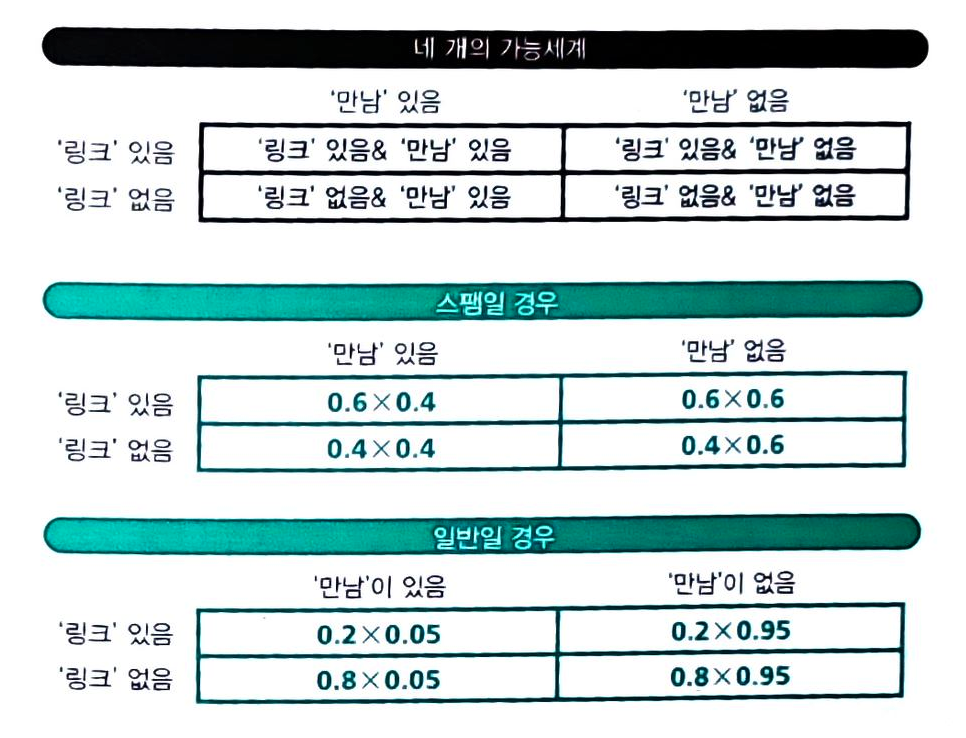
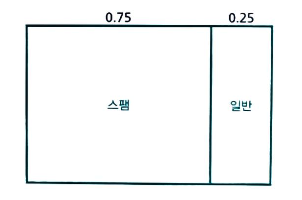
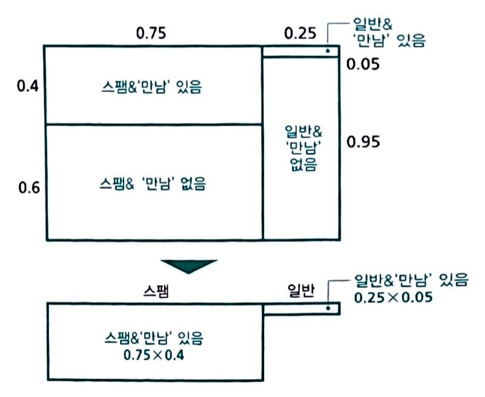

# 세상에서 가장 쉬운 베이즈통계학 입문 - 1

저 : 고지마 히로유키
번역 : 장은정

## 베이즈 추정의 프로세스 정리

1. 타입에 대한 __사전확률__의 설정
    - 쇼핑족과 아이쇼핑족이 있다. (0.2, 0.8)
2. 각 타입에 대한 조건부 확률의 설정
    - 각각 말을 걸 확률은 ( 쇼핑족 0.9, 아이소핑족 0.1)

3. 행동의 관측
    - 말을 걸어왔다
4. 일어나지 않을 가능성의 소거
    - 말을 걸지 않는다를 지운다
    
5. 타인에 대한 확률의 정규화
    - 더해서 1이 되도록 만든다
6. 사후확률(베이즈 역활률)
    - 말을 거는 손님이 살 확률이 달라졌다.
    

- 베이즈 추정이란 __사전확률의 행동의 관찰(정보)에 의거해 사후확률로 베이즈 갱신하는 것__

### 베이즈 추정은 때로 직감에 크게 반한다
> ex. 특정 암에 걸릴 확률 0.1%, 암에 걸렸을 때 검사에서 양성이 나올 확률 95%, 건강하지만 검사에서 양성이 나올 확률 2% (오진). 이 경우 양성일 경우 암에 걸려 있을 확률?
> 단순학게 95%가 아님.
> 검사에서 양성이 나왔을 떄 암에 걸려 있을 사후확률을 구하는 것임.
> 위의 프로세스에 따라서 결과를 구하면 약 4.5%가 나온다.
>
>> - 95% -> 4.5% 줄은 이유 : 원래 암에 걸린 사람 자체가 드물고 건강한 사람을 양성으로 진단하는 사례 또한 무시할 수 없을 만큼 많다.
>> - 하지만 검사전 1000명 중 1명 꼴에서 20명에 1명꼴로 가능성이 높아졌으므로 마냥 무시해서는 안되는 상태. 

### 주관적인 숫자여도 추정이 가능
- 객관적인 사전 데이터가 없어도 추정이 가능
- 사전확률을 주관적으로 설정(__주관확률__)하여 추정을 실시

### 확률의 확률을 사용하여 추정

- Sample 문제 : 어떤 부부의 첫째 아이가 여야였다고 치자. 이때 그 부부에게서 태어날 둘째 아이가 여아일 확률은 몇일까?
- 가정 : 그 부부에게 태어날 아이가 여아일 확률을 0.4, 0.5, 0.6의 세가지 타입으로 설정, 각각 그 타입일 확률은 1/3로. 

- 첫째가 여아기 때문에 일어날 가능성 소거

- 비율로 합이 1이 되도록 수정하면
    - 0.4의 사후확률 = 4/15 = 약 0.27
    - 0.5의 사후확률 = 1/3 = 약 0.33
    - 0.6의 사후확률 = 2/5 = 0.4
- 사전, 사후 확률은 모두 주관 확률 (개인적인 의견으로 판단)

- 다음에 여아가 태어날 확률을 구하려면 기대치를 사용.
    - 0.4 * 0.27 + 0.5 * 0.33 + 0.6 * 0.4 = 0.513
    

## 추론

- 몇 가지 증거를 바탕으로 추리하여 그 사실을 밝혀내려는 행위
- 논리적 추론 : 논리학의 연역법에 따라 엄밀하게 결론을 도출
- 확률적 추론 : 불확실한 부분이 있을 때. 대체로 **다라는 결론
    - 표준 통계학 추정 : 일정한 리스크를 감수. **다와 같은 형식으로 하나의 결론 (네이만 피어슨 식 추정, 유의 수준) : 유의 수준이 리스크의 지표. ( 같은 방법으로 가설검정을 되풀이하는 경우에 유의수준의 확률로 잘못된 결론을 내린다. )
    - 베이즈 추정 : 양쪽 다 가능하지만 **의 가능성이 더 높다라는 형식. : 리스크 평가는 사후확률 그 차제. 항상 자의성이 있으며 그 책임은 통계가의 판단
    - 최우원리 : 관측된 현상이 일어날 확률이 가장 커지는 원인을 채용
        - 베이즈의 사전확률은 최우원리를 응용한 한 형태
        - 표준 통계학의 점추정에서 곽측된 현상의 확률을 최대한으로 하는 함수를 추정치로 채용.(최우원리 응용)
        - 표준 통계학, 베이즈 : 최우원리라는 공통된 사상이 내재.
- 몬티홀 문제의 베이즈 추론
    - A, B, C를 커튼 A에 자동차, 커튼 B에 자동차, 커튼 C에 자동차로 약기
    
    
    - 조건부 확률 설정. 커튼 A를 골랐을 때 A에 자동차가 있다면 B, C를 1/2 확률로 연다. B에 자동차가 있다면 C를 1의 확률로, C에 있다면 B를 1의 확률로 연다.
    

    - B를 열면 일어날 가능성 없는 세계 소거
    

    - 따라서 사후 확률은 A : 1/3, C : 2/3  => C로 변경하는 것이 좋다.
    - 만약 모델 설정을 바꾸면 (커튼 여는 조건을 바꾸게 되면) 사후 확률 변화가 없게도 할 수 있다. (A를 고르고 A뒤에 차가 있으면 무조건 B를 연다라는 조건)

## 복수의 정보를 얻었을 떄의 추정.

### 독립 시행

- 시행 : 복수의 가능성이 있고 각각의 가능성에 확률을 할당할 수 있는 경우.   ex : 주사위를 던져서 나온 눈을 확인하는 것.
- 직적시행 : 여러 시행을 묶어서 하나로 만든 시행   ex : 1시행 : 동전을 던지는 것, 2시행 : 주사위를 던지는 것. 2가지의 시행을 합친 시행.

-독립시행 : 한쪽 시행이 다른 쪽 시행의 결과에 영향을 주지 않는 것.
-독립시행의 확률 : 각 시행의 확률의 곱.   ex : 1시행의 확률이 1/2이고 2시행의 확률이 1/6이면 두 시행을 합친 시행의 확률은 1/12

### 두 개의 정보로부터 사후확률을 계산하는 방법 - 스팸메일 필터

1. 사전확률 설정 : 스팸메일인가 일반메일인가에 0.5씩 할당. (다른 값을 설정해도 관계없다)
2. 조건부 확률 설정 : 스팸메일에 자주 나오는 글자나 문구 혹은 특징으로 조건부 확률 설정 ex : 스팸 -> URL 링크 있는 경우 0.6, 일반 -> URL 링크가 있는 경우 0.2
3. 사후 확률 구하기 : 전에 사후 확률 구하는 방식으로 사후확률 구하기  ex : 링크가 있다는 조건에서 스팸일 사후확률 0.75
4. 또다른 조건의 확률 설정 : 또다른 조건으로 조건부 확률 설정  ex : 스팸 -> 만남이라는 단어 있는 경우 0.4, 일반 -> 만남이라는 단어 있는 경우 0.05

5. 변경된 조건부 확률에서 사후확률 구하기 : 일어나 가능성이 없는 세계 소거 ex : 랑크 & 만남 있는 경우. 스팸 : 0.96, 일반 : 0.04

- 두 가지 정보를 사용한 베이즈 추정은 기본적으로 한가지 정보를 사용한 베이즈 추정과 같은 방법.

### 정보를 순차적으로 사용 - 축차합리성

- 전 스팸메일 예제를 순차적으로 사용하는 것으로 변경

1. 첫번쨰 조건부 확률로 구한 사전 확률 스팸 0.75, 일반 0.25 (앞의 3번 결과)를 사전확률로 설정

2. 정보 2를 사용하여 베이즈 갱신

- 최종 구한 값을 보면 이전에 구한 값과 동일하다. ( 스팸 : 0.96, 일반 : 0.04 )
- __축차합리성__ : 두 가지 정보를 한꺼번에 사용하여 추정한 결과와 첫번째 정보를 사용하여 추정하고, 그 추정 결과를 사전확률로 두고 두 번째 정보를 사용하여 추정한 결과가 일치   일단 추측에 사용한 정보는 버려도 문제되지 않는다.(학습기능의 일종으로 볼 수 있다)

### 정보를 얻을 수록 더 정확한 추정

- 예제 : 단지 A에는 흰공 아홉개, 검은공 한개, 단지 B에는 흰공 두개, 검은공 여덟개. 공을 꺼내서 확인 후 다시 공을 집어 넣고 다시 공을 꺼내서 확인을 반복할 경우
    1. 공을 하나 꺼냈을 떄 검은 공이면 A일 사후 확률이 1/9, B일 사후 확률이 8/9
    2. 1의 결과를 사전확률로 놓고 다시 공을 꺼냈을때
        - 흑인 경우의 사후확률은 A : 1/65. B : 64/65
        - 백인 경우의 사후확률은 A : 9/25, B : 16/25
    3. 1, 2를 반복했을 때 사전확률을 a, b라고 하면  
        - 흑인 경우의 사후확률은 A : a / (a+8b) B : 8b / (a+8b)
        - 백인 경우의 사후확률은 A : 9a / (9a+2b) B : 2b / (9a+2b)
    4. n+1 번째에서 흑이 관측된 경우엔  B일 확률이 높아지고 반대인 경우에 A일 확률이 높아진다.
    5. 만약 단지가 B였다고 하면 관측을 반복할 수록 B의 확률이 점점 높아지고 B의 확률은 1에 가까워지고 A의 확률은 0에 가까워진다.
    6. 즉 실제 단지와 추정한 단지가 B로 일치한다.

- 베이즈 추정은 정보가 많을 수록 정확한 결론을 내릴 수 있다.

