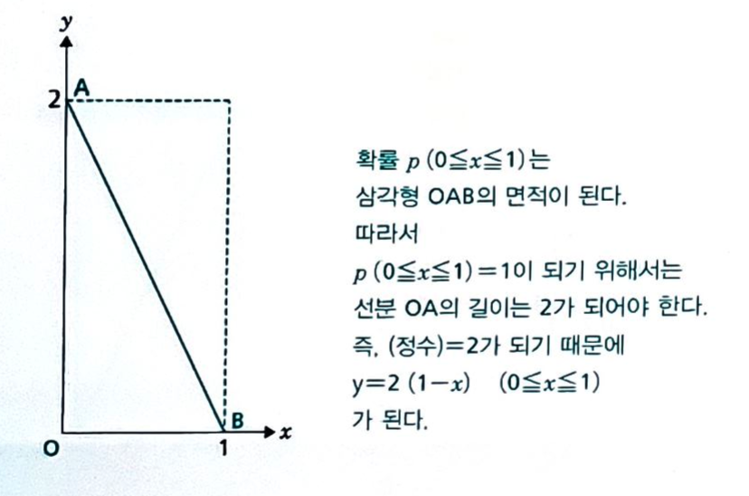
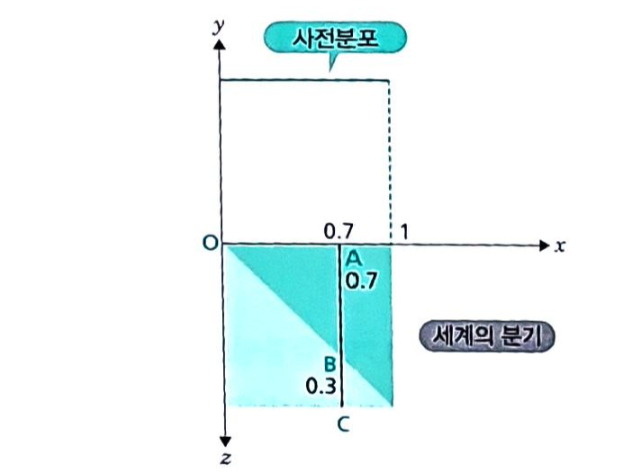
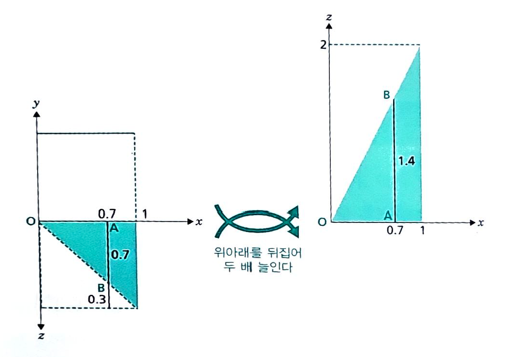
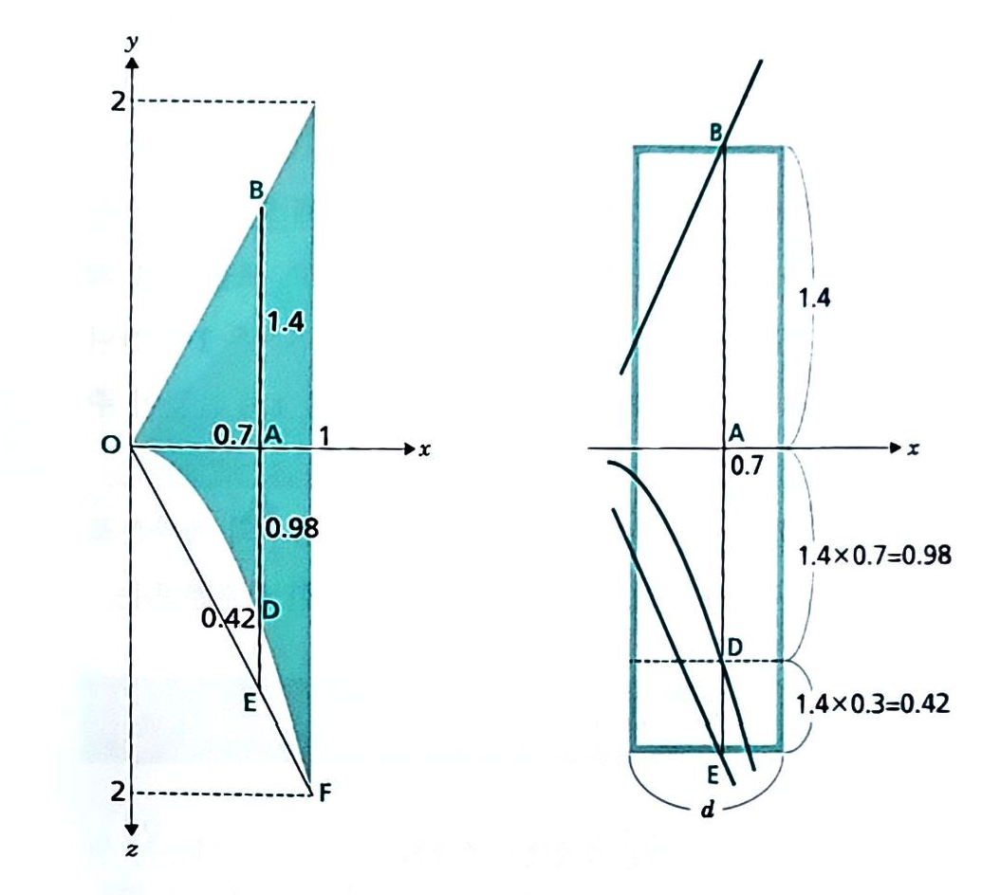

# 세상에서 가장 쉬운 베이즈통계학 입문 - 2

저 : 고지마 히로유키
번역 : 장은정

## 확률 기호

- 확률 모델은 근원사상, 사상, 확률에 의해 구성
    - 근원 사상 : 더이상 분해 할 수 없는 근본적인 사건
    - 사상 : 근원사상을 몇가지 모아놓은 집합
    - 근원사상에 대해서 그 확룔은 $p(\{e\})$로 표시
    - 근원 사상 e, f, g로 구성된 사상 {e, f, g}의 확률은 $p(\{e, f, g\}) = p(\{e\}) + p(\{f\}) + p(\{g\})$로 정의
- 확률의 가법 법칙 : A와 B가 중첩되지 않는 사상일 떄, $p(A or B) = p(A) + p(B)$
- 독립시행인 경우 a 발생하고 b 발생할 (직적시행) 확률 : $p( \{ a \& b \}) = p(\{a\}) \times p(\{b\})$

## 조건부 확률

- 정보가 들어와서 근원사상이 줄어든 세계에 비례관계를 부여
- 사상 B라는 정보하에서 사상 A의 조건부 확률 $p( A | B )$는 다음의 식으로 정의
$$ p( A | B ) = p(A와 B의 중첩) \div p(B) $$
- 베이즈 추정에서는 조건부 확률의 공식을 두 단계로 사용
    1. 타입 & 정보의 확률을 구하는 것 : $p(타입 \& 정보) = p(타입) \times p(정보 | 타입) $
    2. 사후확률을 구하는 것. 주어진 데이터 하에서 $p(타입 \& 정보)$의 비례관계를 이용
- __사전확률__ : 사전에 정의되어 있는 확률 ( $p(A), p(B), p(C)$ A, B, C가 일어날 확률 )
- __조건부 확률__ : 어느 조건일 때 사건이 일어날 확률 ( $p(A | B)$ B가 일어났을 떄 A가 일어날 확률)
- __서후확률__ : 어떤 사건(A)이 일어났을 때 그게 사건 (B)로 부터 일어난 것이라고 생각되는 조건부 확률 ( $p(B | A)$)
- __베이즈 정리__ : n개의 사건 $B_1, B_2, \dots, B_n$은 표본공간 S를 분할하고, 사건 A가 표본공간 S의 임의의 사건이라면,
$$ p(B_i | A) = \frac{p(B_i) \times p(A | B_i)}{\sum_{i=1}^{n} p(B_i) \times p(A | B_i)} $$
- 확률의 곱셈정리와 전체 확률의 법칙 이용
$$ p(B_i | A) = \frac{p(B_i \cap A)}{p(A)} $$
$$ p(B_i \cap A) = p(B_i) \times p(A | B_i) $$
$$ p(A) = \sum_{i=1}^{n} p(B_i) \times p(A | B_i) $$

- 확률 $p(A|B)$를 알고 있을 떄 관계가 정반대인 $p(B|A)$를 계산

## 균등 분포

- 각 사건이 일어날 확률이 동일한 분포.
- ex : 주사위를 던졌을 때 각 사건이 일어날 확률 1/6
- 연속적인 사건에서의 균등 분포일 경우 특정 사건이 일어날 확률은 0에 수렴하고 그 사건들의 확률을 모두 더하면 1이다. 
- 0을 다 더하면 1이 된다는 모순되는 의미로 연속적인 사건의 확률은 구간의 확률로 계산.
- 즉 전체 구간의 확률은 1이고 특정 구간에서 일어난 확률은 그 구간의 폭이 된다.
- ex : 전체 구간이 $0 \leq x < 1 $ 인 경우  $ 0 \leq x < t $ 의 확률 $p(0 \leq x < t) $ 는 폭 t 이다.
- 확률분포도 : 가로축에 수치, 세로축에 확률을 설정. 연속형의 경우 세로축은 __확률밀도__
- 균등분포의 확률분포도는 수평한 직선(선분). 확률은 직사각형 면적. 
- 확률 = 확률밀도 * 구간의 길이

## 베타분포

$$ y = (정수) \times x^{\alpha - 1}(1-x)^{\beta - 1}\qquad (0 \leq x \leq 1) $$

- $\alpha$ 와 $\beta$는 1이상의 자연수로 베타분포의 종류를 특정해 주는 값.
- ex : $ \alpha = 1 \quad \beta = 1$ 인 경우 : $ y = 1 \Leftarrow $ 0부터 1까지의 균등분포
- ex : $ \alpha = 2 \quad \beta = 1$ 인 경우 : $ y = 2x $

- ex : $ \alpha = 1 \quad \beta = 2$ 인 경우 : $ y = 2(1-x) $

- ex : $ \alpha = 2 \quad \beta = 2$ 인 경우 : $ y = 6x(1-x) $

- 정수는 정규화 조건(면적이 1)로 부터 구해지게 된다.
- 베타분포는 $\alpha \; \beta$ 가 커지면 복잡해진다.

## 기대치 

- 확률뷴포를 하나의 수치로 대표하는 값
- $ 확률뷴포의 기대치 = \sum (수치 \times 그 수치가 나올 확률) $ : __가중평균__
- 매번 기대치를 합계해 나가면 장기적으로는 실제 점수의 합계와 거의 값은 값이 된다. → 기대치가 장기적인 수치의 합계라는 의미에서 현실을 적중시킨다.
- 즉 N의 값이 충분히 클 떄 $(N번으로 실현한 수치의 합계) \approx (기대치의 N배) $
- 기대치는 확률분포도에서 균형을 이루는 지점. (회전력의 합이 0)
- 베타분포에서 기대치 : $ \frac{\alpha}{\alpha + \beta} $

## 베타분포를 이용한 추정

- 타입 x의 사전 분포를 균등분포로 설정하면 사후분포는 베타분포가 된다.
- 세계의 분기는 $p(타입 x) \times x 와 p(타입 x) \times ( 1-x ) $로 계산한다.
- 타입 x의 확률분포가 아니라 타입 그 자체를 추정하려고 할 때는 베타분포의 기대치를 사용.
- 공액사전분포 : 사전분포와 사후분포가 같은 분포를 따르게 하는 서전분포
- EX:
> 어떤 부부에게 여아가 태어날 확률 x.  
> 사전 분포를 균등 분포로 $ y = 1 \quad ( 0 \leq x \leq 1) $ 로 설정 후 계산하면

이 상황에서 첫째가 여아가 태어났다고 하면 

이 것은 $ \alpha=2 \quad \beta=1 $ 인 베타분포이다. 
따라서 기대치는 $\frac{2}{3}$ : 사전에 반반이었던 여아가 태어날 확률이 첫째 아이가 여아라는 정보를 얻은 후에는 변경된다. 
둘때도 여자아이가 태어났다고 하면 이전에 구했던 사후 분포를 사전분포로 사용하여 계산

$p(여아 | x) = x $  
$p((부부가 타입 x) \& (타입 x인 부부로부터 여아가 태어남))$ 
$ = p(타입x) \times p(여아 | x)$ 
$ = 2x \ times x = 2x^2 $ 
왼쪽 그림의 하단 부분의 짙은 부분이 여아가 태어날 확률이므로 그 부분을 정규화 하면  
$ y = 3x^2 $ 이라는 베타분포가 된다. ($\alpha=3 \quad \beta=1) 
따라서 기대값은 3/4

- 만약 사전분포를 균등 분포로 하지 않고 0.5 쪽이 많은 베타 분포 $y=6x(1-x)$로 잡으면 사후분포 역시 베타분포 $z=12x^2(1-x)$가 ($\alpha=3 \quad \beta=2$)나온다. 이 경우의 기대치는 $\frac{3}{5}$

## 정규분포로 베이즈 추정

- 사전분포를 정규분포로 설정. : 정보 x의 확률분포 $p(x|\theta)$가 $\theta$를 평균으로 하는 정규분포
- 사후분포도 정규분포가 된다.
- $\theta$의 사전분포를 평균 $\mu_0$, 표준편차 $\sigma_0$의 정규분포이고 관측하는 정보 x가 평균 $\theta$, 표준편차 $\sigma$를 따른다고 하면, 관측된 값 x하에서 $\theta$의 사후분포는 정규분포이고, 그 평균은 
$$ \frac{\frac{1}{\sigma_0^2}\times \mu_0 + \frac{1}{\sigma^2}\times x}{\frac{1}{\sigma_0^2} + \frac{1}{\sigma^2}}$$
- 복수 관측할 경우 관측된 n개의 평균을 $\bar{x}$라 하면, 관측된 $\bar{x}$하에서 $\theta$의 사후분포는 정규분포. 평균은
$$ \frac{\frac{1}{\sigma_0^2}\times \mu_0 + \frac{n}{\sigma^2}\times \bar{x}}{\frac{1}{\sigma_0^2} + \frac{n}{\sigma^2}} $$